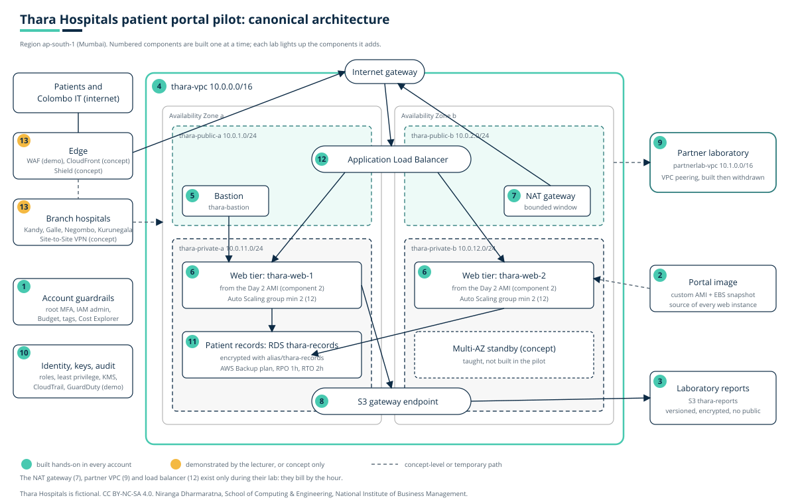

# Cloud Computing

**Higher National Diploma in Network Engineering, Year 2**

Over seven teaching days you will build, secure, monitor and cost a small cloud environment on Amazon Web Services, in your own AWS account, one piece at a time. Every lab adds a numbered component to the same architecture: a patient portal pilot for **Thara Hospitals**, a fictional private hospital group in Sri Lanka. By Day 7 you will have built the whole thing and taken it apart again.

**Before Day 1, read [getting-started.md](getting-started.md).** Your AWS account has to be created at the right time, and there are rules that keep your free credits intact.

## What you will be able to do

1. Explain the key differences between virtualisation and containerisation.
2. Explain cloud computing concepts.
3. Explain high availability (HA) concepts.
4. Describe the core features of cloud computing.
5. Implement, scale, and manage cloud instances with storage, networking, and security features.
6. Manage cloud data by configuring storage and backups.
7. Explain virtual private clouds, subnets, gateways, and other cloud networking options.
8. Describe the security features of cloud computing.

## The scenario

Read [scenario/organisation.md](scenario/organisation.md) once before Day 1 and keep the diagram open during every lab.

## Days

| Day | Morning | Afternoon | You build |
|---|---|---|---|
| [Day 1](days/day-1/) | Cloud as a model | Account guardrails | 1 |
| [Day 2](days/day-2/) | Instances, images and volumes | Build, image, containerise | 2, 3 |
| [Day 3](days/day-3/) | VPC anatomy | Build the Thara network | 4, 5, 6 |
| [Day 4](days/day-4/) | Beyond the VPC | Egress, endpoint and the partner laboratory | 7, 8, 9 |
| [Day 5](days/day-5/) | Identity, encryption, detection | Least privilege, keys, trails | 10 |
| [Day 6](days/day-6/) | Storage strategy, managed databases, recovery | Reports bucket, patient records, proven restore | 3, 11 |
| [Day 7](days/day-7/) | High availability delivered and monitored | Break/fix drill and capstone integration | 12, 13 |
| [Review](days/review/) | Review session | | |

Each day folder holds that day's slides, notes, lab sheet and interactive visuals. Material is posted before each teaching day.

## How a teaching day works

The morning builds the ideas, ending with a short live demonstration. The afternoon is a lab in your own account. Every lab sheet has the same shape: numbered steps with what you should see, a **prove it** step that confirms your build works, a **break it** step where you introduce a fault on purpose and find it, a teardown list, and a cost line for your ledger. Between days there is reading, a short self-check, a practice question, and an evidence pack.

## Coursework

| Component | Weight | What |
|---|---|---|
| [Individual build portfolio](coursework/portfolio-brief.md) | 20% | Six evidence packs, one after each of Days 1 to 6; best five count |
| [Group capstone](coursework/capstone-brief.md) | 30% | The Thara pilot built by your group in one account, with a design justification and a viva |

Templates: [evidence pack](templates/evidence-pack.md), [cost ledger](templates/cost-ledger.csv).

## Practice

[practice/](practice/) holds the practice questions, one per teaching day.

## Reading

| | |
|---|---|
| Core | Erl, T. and Barceló Monroy, E. (2023) *Cloud Computing: Concepts, Technology, Security, and Architecture*, 2nd ed. Pearson. |
| Core | Piper, B. and Clinton, D. (2023) *AWS Certified Cloud Practitioner Study Guide: Foundational (CLF-C02) Exam*, 2nd ed. Sybex. |
| Core | Wittig, A. and Wittig, M. (2023) *Amazon Web Services in Action*, 3rd ed. Manning. |
| Recommended | Shields, D. (2022) *AWS Security*. Manning. |
| Free | AWS Skill Builder, *AWS Cloud Practitioner Essentials* |
| Free | AWS *Well-Architected Framework*; *Amazon VPC User Guide*; *IAM User Guide* |

Each day's page says which chapters to read.

## Licence

Niranga Dharmaratna  
School of Computing & Engineering  
National Institute of Business Management

Teaching content © 2026 Niranga Dharmaratna, [CC BY-NC-SA 4.0](LICENSE-CONTENT.md). Interactive visuals and code, [MIT](LICENSE). Thara Hospitals is fictional. AWS is a trademark of Amazon.com, Inc. or its affiliates; this material is not affiliated with or endorsed by AWS.
