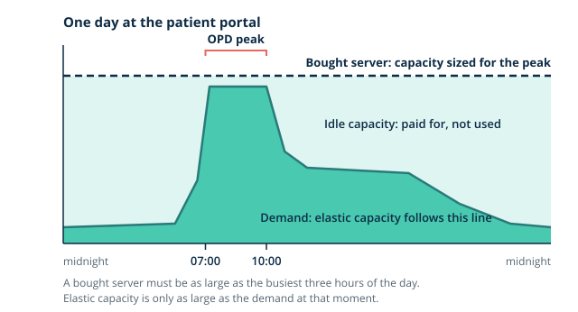
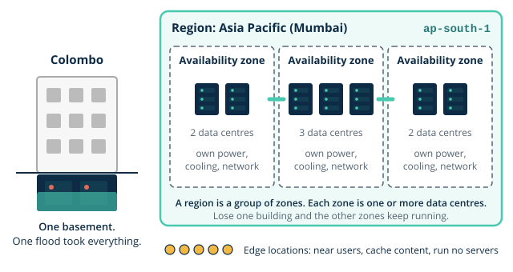

# Day 1 notes: Cloud as a model

These notes go with the morning slides. They build the ideas you need before this afternoon's lab, where you secure your account and build component 1 of the Thara architecture.

## Where you are starting

You arrive knowing more than you think. In Year 1 you carved address blocks into subnets, read routing tables, configured NAT so many inside hosts share one outside address, and resolved names with DNS. You can move around a shell and read a log. Cloud networking on Day 3 and Day 4 reuses every one of those ideas; today's job is to understand what the cloud *is*, so that those skills have somewhere to land. The short diagnostic in this session checks that recall, so that anything shaky can be fixed before Day 3.

Keep one organisation in mind all day: **Thara Hospitals**, a private hospital group whose portal and laboratory reports ran on two servers in a Colombo basement until the monsoon flooded it. You will build its pilot on AWS over seven days. Read the [scenario](../../scenario/organisation.md) if you have not.

## 1. Why Thara cannot buy another server

After the flood, the obvious answer is a new server somewhere drier. The cloud answer is different, for four reasons.

**Capital versus operating expenditure.** A server is *capital expenditure* (capex): money paid up front for an asset you then own, depreciate and eventually throw away. The basement servers are sunk capital; the flood did not refund them. Cloud is *operating expenditure* (opex): you pay monthly for what you use, like electricity, and you can stop paying when you stop using it.

**[Elasticity](../../glossary.md#elasticity).** Thara's portal is busiest in the morning outpatient (OPD) peak, 07:00 to 10:00, and in dengue season traffic can triple for weeks. A bought server has to be sized for that peak, so it idles most of the day and most of the year. *Elasticity* means capacity that grows and shrinks with demand, and you pay only for what runs.

**Economies of scale.** A hyperscaler such as AWS buys hardware, power and bandwidth by the building, runs data centres far more reliable than any hospital basement, and spreads the cost over millions of customers. Thara could never build three independent data centres; it can rent space in three.

**The trade-off.** None of this is free. Thara becomes *dependent* on one provider and its prices. Patient data now sits in another country, which the Data Protection Officer must be able to justify. And the IT team needs new skills. A good cloud case names these costs rather than hiding them.

> **You already know this.** Buying a core switch sized for the busiest hour of the year: you pay for 48 ports at full line rate, and most nights three of them are lit.

> **Thara.** The monsoon destroyed the servers and three days of service. The CFO has now approved USD 150 a month for a six-month pilot, and wants an itemised forecast and a monthly actual against it. Every lab in this module ends with a cost line for that reason.

> **Quick check.** In dengue season portal traffic triples for three weeks, then falls back. Which reply is the elasticity argument for the pilot?
>
> - [ ] Buy a server sized for the dengue peak and own it outright
> - [x] Add capacity for the three weeks, remove it after, and pay only while it runs
> - [ ] Rely on AWS, which buys its hardware far more cheaply than Thara can
>
> **Why:** Elasticity is capacity that follows demand, so the surge is paid for only while it lasts. The third reply is economies of scale: true, but a different argument.

## 2. What cloud is, formally

The standard definition comes from the US National Institute of Standards and Technology (NIST). A service is cloud when it has five characteristics:

- **On-demand self-service:** you create resources yourself, from a console or an API, without raising a ticket.
- **Broad network access:** you reach them over the network from ordinary devices.
- **Resource pooling:** the provider serves many customers from shared hardware, and you do not choose the physical machine.
- **Rapid elasticity:** capacity can be added and removed quickly, often automatically.
- **Measured service:** usage is metered, and you pay for what the meter records.

**Service models** describe *who does what*. Think of a stack of layers: facility, network, servers, storage, virtualisation, operating system, runtime, application, data. In **[IaaS](../../glossary.md#iaas)** (infrastructure as a service) the provider runs everything up to virtualisation and you run the operating system upwards. In **PaaS** (platform as a service) the provider also runs the operating system and runtime; you bring the application and data. In **SaaS** (software as a service) you only use the application and own your data and who can access it. These are points on a spectrum, not boxes.

**Deployment models** describe *whose cloud*. A **public** cloud is shared infrastructure run by a provider such as AWS. A **private** cloud is dedicated to one organisation, often in its own data centre. A **hybrid** cloud connects the two. Thara's pilot is public; with the HIS still in the basement and branches to connect later, its future is hybrid.

> **You already know this.** Leasing a rack in a colocation centre (they give you power, cooling and a cross-connect; you bring and run the servers) versus renting the whole service from a managed provider.

> **Thara.** The patient portal will run on EC2 virtual servers where Thara manages the operating system: that is IaaS. A managed database, where AWS patches the engine, is PaaS-shaped. Try it in [responsibility-spectrum](artefacts/responsibility-spectrum.html).

## 3. Where AWS is

**[Regions](../../glossary.md#region)** are separate geographic areas, such as Asia Pacific (Mumbai). Each region contains several **[availability zones](../../glossary.md#availability-zone)** (AZs). An AZ is one or more data centres with their own power, cooling and networking, far enough from the other AZs in the region that a flood, fire or power failure in one should not reach the others, and close enough to be joined by fast, low-latency links. **Edge locations** are many more, smaller sites near users that cache content and answer DNS; they do not run your servers.

**Why AZs exist.** If you run two copies of something in two AZs, losing one building does not stop the service. This is the first seed of high availability, which you build properly on Day 7.

**Regional and global services.** Most services are *regional*: an EC2 server you create in Mumbai exists only in Mumbai, and if you switch the console to another region you will not see it. A few are *global*: IAM, which holds users and permissions, has no region selector at all, because who you are should not depend on where your servers are.

> **Quick check.** A colleague creates a test server with the console set to another region, then switches back to Mumbai and cannot find it. Where is it?
>
> - [x] In the region that was selected when it was created
> - [ ] In Mumbai, because that is the account's home region
> - [ ] Nowhere: it was removed when she switched regions
>
> **Why:** Most services are regional, so a resource exists only in the region where it was created. A home region is a habit you keep, not a setting that AWS enforces.

**Why ap-south-1.** This module's home region is **Asia Pacific (Mumbai), ap-south-1**. At the time of writing it has three AZs, is enabled for every new account, and is the nearest such region to Colombo: about 1,550 km. Singapore is nearly twice as far; US East (N. Virginia) is about 14,400 km away and would put patient data on another continent. Hyderabad is also in India and slightly closer on the map, but it is a newer region that must be switched on before use. Distance becomes delay: light in fibre covers about 200 km per millisecond, so a round trip to Mumbai cannot be faster than about 15 ms, and real paths are longer. Compare regions yourself in [region-az-explorer](artefacts/region-az-explorer.html).

> **You already know this.** Two data centres in different suburbs on different power feeds, joined by dark fibre: if the Borella substation trips, the Rajagiriya site keeps running.

> **Thara.** Colombo has one basement, and one flood took everything. Mumbai has three AZs.

> **Common mistake.** "A region is a data centre." A region is a group of AZs, and each AZ is itself one or more data centres. Losing a data centre is an AZ problem, not a region problem, if you designed for it.

> **Quick check.** The portal runs as two copies in two availability zones of `ap-south-1`. One data centre in Mumbai loses power. What happens?
>
> - [ ] The region is down, because a region is a data centre
> - [x] At most one zone is affected, and the copy in the other keeps serving
> - [ ] Edge locations near Colombo take over running the servers
>
> **Why:** A region is a group of zones, and each zone is one or more data centres with its own power. Edge locations cache content and answer DNS; they do not run your servers.

## 4. Virtualisation and containerisation

Both let one physical machine run many isolated workloads. They draw the isolation boundary in different places.

**[Hypervisors](../../glossary.md#hypervisor).** A *hypervisor* runs virtual machines (VMs), each with its own complete operating system and kernel. A **Type 1** hypervisor runs directly on the hardware (bare metal); a **Type 2** hypervisor runs as an application on a host operating system, like VirtualBox on your laptop. **Hardware-assisted virtualisation** means the CPU itself has instructions to switch safely between VMs, so the hypervisor stays small and fast. AWS runs EC2 on the **Nitro System**: dedicated hardware cards take over networking, storage and security functions, leaving a very thin Type 1 hypervisor and almost all of the server's resources for your VM.

**[Containers](../../glossary.md#container).** A container is *OS-level virtualisation*. There is one kernel, the host's, and each container is a group of ordinary processes that the kernel shows a restricted view of the system. **Namespaces** give a container its own view of process ids, network interfaces, mount points and hostname, so it seems to be alone. **Control groups (cgroups)** limit how much CPU and memory it may use. No second kernel boots, which is why containers start fast and pack densely.

| | Virtual machine | Container |
|---|---|---|
| Isolation boundary | The hypervisor: separate kernels | The shared kernel: namespaces and cgroups |
| Density | Fewer per host (each carries a whole OS) | Many more per host |
| Start time | Seconds to minutes (an OS boots) | Typically under a second to a few seconds (a process starts) |
| Attack surface | An escape must break the hypervisor | An escape must break the shared kernel, which every container on the host uses |

**Where each fits.** An EC2 instance *is* a VM. A container runs *inside* a VM such as an EC2 instance, or on a managed container service that runs those VMs for you. You will run one on Day 2. See [vm-vs-container](artefacts/vm-vs-container.html) and launch three more of each.

> **You already know this.** A VLAN isolates at layer 2; a hypervisor isolates the hardware; a container isolates a process tree. Each is a real boundary, drawn at a different layer.

> **Thara.** Should the portal ship as a VM image or as a container image? Tomorrow you build both on the same instance and compare them. The practice question for today asks you to argue it.

> **Common mistake.** "Containers are lightweight VMs." They share the host's kernel. The boundary is not a thinner version of a VM's; it is a different boundary, with a different attack surface.

> **Quick check.** Three copies of the portal run as containers on one EC2 instance. What stands between one container and the next?
>
> - [ ] A hypervisor, because each container boots its own kernel
> - [ ] Nothing: containers on one host share everything they hold
> - [x] The host's one kernel, through namespaces and cgroups
>
> **Why:** Containers share the host's kernel, which shows each one a restricted view. The first option describes virtual machines, which is why a container is not a lightweight VM.

## 5. Who secures what

The **[Shared Responsibility Model](../../glossary.md#shared-responsibility-model)** is an allocation of work between AWS and the customer. It is not a slogan, and it changes with the service.

- **Security *of* the cloud** is AWS's: the buildings, the hardware, the network between AZs, the hypervisor, and the software of the managed services.
- **Security *in* the cloud** is the customer's: who has access, how data is protected, how things are configured.

Applied to **EC2**, Thara patches the operating system, configures the firewall rules and controls logins. Applied to a **managed database**, AWS patches the database engine, while Thara still decides who can connect, whether data is encrypted and where backups go. Move right along the service-model spectrum and more work passes to AWS, but data and access never do.

> **You already know this.** The ISP owns the fibre and the CPE up to the demarcation point; you own the firewall rules behind it. A leak through an open port is not the ISP's fault.

> **Thara.** The Data Protection Officer, appointed under Sri Lanka's Personal Data Protection Act, asks "who can read patient data?". The answer is different at each layer: AWS for the disks in the data centre, Thara for the operating system, the database logins and the application.

> **Common mistake.** "The cloud is secure." AWS secures the cloud. Everything Thara puts in it is Thara's to secure, starting this afternoon with the account itself.

> **Quick check.** The portal's records sit in a managed database. A patch for the database engine is released. Who applies it, and who decides which staff may connect?
>
> - [x] AWS applies the patch; Thara decides who may connect
> - [ ] AWS does both, because the service is a managed one
> - [ ] Thara does both, because the data belongs to Thara
>
> **Why:** A managed service passes the engine's patching to AWS. Data and access never pass to AWS, whatever the service, so who may connect stays with Thara.

## Before the lab

- Bring your phone with an authenticator app installed, and know your root email address and password.
- If AWS made you register [MFA](../../glossary.md#mfa) when you first signed in, that is fine: you will verify it rather than add another.
- Download the [cost ledger](../../templates/cost-ledger.csv).
- Your personal [budget](../../glossary.md#budget) will be USD 50 a month. That is your safety net for your credits; Thara's USD 150 is the scenario's ceiling. Do not confuse the two.
- You will sign in as root for the last time today. Decide now where your admin password will live.

## Reading

- Erl, T. and Barceló Monroy, E. *Cloud Computing: Concepts, Technology, Security, and Architecture*, 2nd edition, Pearson. Chapters 3 and 4 (understanding cloud computing; fundamental concepts and models).
- AWS Skill Builder, *AWS Cloud Practitioner Essentials*, module 1 (recap).
- NIST Special Publication 800-145, *The NIST Definition of Cloud Computing*, the source of the five characteristics.
- AWS, *IAM User Guide*, "Security best practices" (root, MFA, access keys), before or after the lab.

Self-check: CLF-C02 bank, Domain 1 set A (15 items), issued separately. Practice question: [PQ1](../../practice/PQ1.md).
