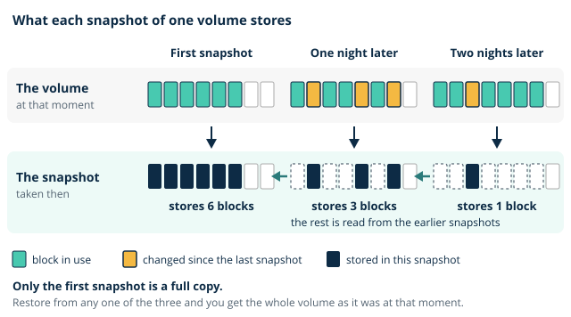
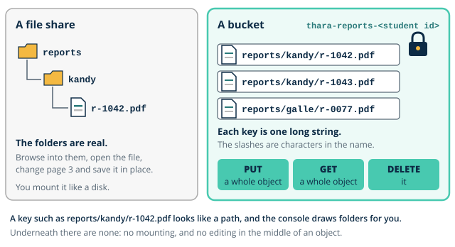

# Day 2 notes: Instances, images and volumes

These notes go with the morning slides. They build the ideas you need before this afternoon's lab, where you build component 2 (the patient portal web server and its image) and component 3 (the laboratory reports bucket) of the Thara architecture.

## Where you are starting

Yesterday you built component 1, the guardrails. Your account has MFA on root, a named admin user with MFA that you now use for everything, a budget called `thara-budget` that excludes credits so it measures gross usage, the region pinned to Asia Pacific (Mumbai), and the first row of your cost ledger. You also met two ideas on paper only: an EC2 instance is a virtual machine, and a container is a group of processes sharing the host's kernel. And you were told "[access keys](../../glossary.md#access-key) on neither user today".

Today those ideas become things you can touch. Inside the locked account you put the first server and the first bucket. The morning explains what they are made of and what they cost; the afternoon has you build them. Watch the demonstration closely: it is the first half of your lab, performed once in front of you.

## 1. The EC2 model

Amazon EC2 (Elastic Compute Cloud) rents you virtual machines, called **instances**.

**Families and sizes.** An instance type such as `t3.micro` reads as family, generation, size. The family says what the hardware is balanced for (general purpose, compute, memory, storage); the size sets how much of it you get. `t3.micro` has 2 virtual CPUs and 1 GiB of memory, and it is *burstable*: it is priced for a workload that is mostly quiet with short busy spells. That describes a pilot web server, it is allowed on the Free Plan, and at the time of writing it costs about USD 0.011 an hour in Mumbai. It is this module's workhorse.

**What an instance is launched from.** Four things come together at launch:

- An **[AMI](../../glossary.md#ami)** (Amazon Machine Image) is the template for the instance's disk: an operating system, plus whatever was installed when the image was made. Launch ten instances from one AMI and you get ten identical servers. The AMI is the unit of reproducibility.
- A **[key pair](../../glossary.md#key-pair)** is an SSH key. AWS keeps the public half and puts it on the instance; you download the private half once and AWS never shows it again.
- **[User data](../../glossary.md#user-data)** is a script that runs once, as root, the first time the instance boots. It is first-boot automation: install the web server, write the page, start the service, with nobody logged in.
- **Instance metadata** is a small web service that only the instance itself can reach, at the address `169.254.169.254`. It answers questions such as "what is my instance id?" and "which zone am I in?". On current Amazon Linux you must first request a short-lived token and then present it, which stops a careless web application being tricked into reading it.

> **Quick check.** Ten web servers are launched from one AMI with the same user data. Who logs in to install the web server on each?
>
> - [ ] An administrator, over EC2 Instance Connect, one server at a time
> - [x] Nobody: the user data script runs on each at first boot
> - [ ] Nobody: AWS installs a web server when you ask for one
>
> **Why:** User data runs once, as root, at first boot, with nobody logged in. Logging in to each server is the rack-server habit that user data replaces, and AWS installs nothing above the image you chose.

**Getting in.** There are three ways to reach a shell. **EC2 Instance Connect** opens a terminal in your browser; AWS pushes a temporary key to the instance for sixty seconds, so there is no long-lived key to lose. **Session Manager** reaches the instance through an agent, with no SSH port open at all. Plain **SSH** uses your private key file from your own machine. Key hygiene matters because a private key file is a credential that never expires: whoever holds a copy can log in until someone removes the public half from every server.

**The firewall in front.** Every instance sits behind at least one **[security group](../../glossary.md#security-group)**: a firewall attached to the instance, with allow rules only. It is *stateful*, which means that if a request is allowed in, its reply is allowed out automatically. Today you write two or three rules. Day 3 treats security groups properly.

**The life of an instance.** An instance moves between states: pending, running, stopping, stopped, terminated. Stop is "shut down and keep the disk"; terminate is "delete". What you pay for changes with the state. Try each transition in [instance-lifecycle](artefacts/instance-lifecycle.html) and watch which meters keep running.

> **You already know this.** A rack server built from a golden image, with a KVM console for when the network is down. The AMI is the golden image, user data is the post-install script, and Instance Connect is the KVM.

> **Thara.** The portal web server is the first thing Thara will run in the cloud. This afternoon it is one small instance serving one page: "Thara Hospitals portal (pilot)".

## 2. Block storage and images

**[EBS volumes](../../glossary.md#ebs-volume).** Amazon EBS (Elastic Block Store) provides *block storage*: a virtual disk that you attach to an instance, format with a file system and mount, exactly as you would a physical disk. The default volume type is **gp3**, a general-purpose SSD, and it is the only one you need in this module. A volume lives in **one availability zone** and can only be attached to an instance in that same zone. Its data survives a stop, a start and a reboot.

**[Snapshots](../../glossary.md#snapshot).** A snapshot is a point-in-time copy of a volume, kept in storage that AWS runs on S3, so it does not depend on the zone the volume was in. Snapshots are **incremental**: the first one copies every block in use, and each later one stores only the blocks that have changed since. You can create a new volume from a snapshot in any zone of the region.

**An AMI is a snapshot plus launch metadata.** When you create an image from an instance, AWS takes a snapshot of its root volume and then registers an AMI that points to it. The AMI adds the facts needed to launch: which snapshot becomes the root disk, how big the disk should be, the architecture, the boot settings. The snapshot holds the bytes; the AMI holds the instructions. Step through it in [ami-snapshot-relationship](artefacts/ami-snapshot-relationship.html).

**Instance store, a warning.** Some instance types also offer *instance store*: disks physically inside the host machine. They are fast, and they are **ephemeral**: stop the instance, or lose the host, and the data is gone for good. This module does not use instance store. You only need to recognise it and know never to keep anything on it that you cannot afford to lose.

> **You already know this.** A SAN LUN versus a local scratch disk. The LUN is presented to the server over the storage network and outlives the server; the scratch disk dies with the chassis. EBS is the LUN. Instance store is the scratch disk.

> **Thara.** The flood destroyed the servers and the only copy of how they were built. The portal image must be rebuildable after the next flood: an AMI is a server you can launch again in minutes, in a different zone if need be.

> **Common mistake.** "Stopping an instance stops all billing." It stops the charge for the instance and for its public address. The EBS volumes are still stored, so they still bill, and so do your snapshots.

> **Quick check.** `thara-web-1` is stopped overnight. Its 8 GiB root volume and two snapshots are kept. What is Thara paying for while it is stopped?
>
> - [ ] Nothing: a stopped instance has no charges
> - [ ] The instance itself, at a lower hourly rate
> - [x] The volume and the snapshots, which are still stored
>
> **Why:** Stopping ends the charge for the instance and for its public address. Whatever is still stored still bills, so "stopped" is cheap and not free.

> **Common mistake.** "A snapshot is a full copy every time." Only the first one is. Each later snapshot stores the changed blocks only, yet any single snapshot can still restore the whole volume.

> **Quick check.** A 40 GB volume has one snapshot. Overnight 1 GB of its blocks change, and a second snapshot is taken. What does the second one store, and can it restore the volume by itself?
>
> - [x] About 1 GB, and yes: it restores the whole volume
> - [ ] About 40 GB, and yes: it restores the whole volume
> - [ ] About 1 GB, and only after the first is restored
>
> **Why:** A later snapshot stores only the changed blocks and refers to earlier ones for the rest, so it is small and still complete. You never restore a chain by hand.

## 3. Object storage, first look

**Objects and keys.** Amazon S3 (Simple Storage Service) stores *[objects](../../glossary.md#object)* in *[buckets](../../glossary.md#bucket)*. An object is a blob of data plus a little metadata, stored under a *key*, which is just its name. A key such as `reports/kandy/r-1042.pdf` looks like a path, and the console draws folders for you, but there are no directories underneath: the key is one long string. You do not mount a bucket, open a file in it and edit the middle. You put a whole object, get a whole object, or delete it, over HTTPS.

**Global names, regional service.** A bucket name must be unique across all of AWS, because it becomes part of a web address. Yet the bucket itself is created in one region, and its data stays in that region unless you copy it elsewhere. Your reports bucket lives in Mumbai.

**Storage classes.** Every object has a storage class, which trades retrieval speed and cost against storage price. At this stage they are vocabulary:

| Class | For |
|---|---|
| S3 Standard | Data read often; the default |
| S3 Standard-Infrequent Access | Data kept for a long time and read rarely; cheaper to store, a fee to read |
| S3 Glacier classes | Archives; cheapest to store, and reading back can take from milliseconds to hours depending on the class |

Day 6 moves old reports between classes automatically.

**[Block Public Access](../../glossary.md#block-public-access).** Every new bucket has **Block Public Access** switched on. It is a master switch that overrides any setting that would make the bucket or its objects public. It is on by default, and in this module it stays on.

> **You already know this.** A document management system versus a file share. On a file share you browse folders and edit files in place. In a document management system you check a whole document in under an identifier and fetch it by that identifier. S3 is the document management system.

> **Thara.** Laboratory report PDFs are objects: written once, read a few times, kept for years. The leaked link, where a report opened for anyone who had the address, is a Block Public Access story: with the switch on, no link can make a report public by accident.

> **Common mistake.** "S3 is a file system." It is a key-value object store with no real directories. Treat it as a disk and you will be surprised by what is slow, what costs money and what cannot be done at all.

> **Quick check.** A typing mistake is found on page 3 of a report PDF in the reports bucket. How is it corrected?
>
> - [ ] Mount the bucket on the web server and edit the file
> - [ ] Open the object in S3 and change that one page
> - [x] Get the object, correct it, and put the whole object back
>
> **Why:** S3 has no editing in place and nothing to mount. You get a whole object, change your copy, and put a whole object under the same key.

## 4. Paying for compute

The same instance can be paid for in four ways. Each discount is bought with something.

| Option | What you give up | Typical discount |
|---|---|---|
| **On-demand** | Nothing: pay by the second, stop whenever you like | None. This is the list price |
| **Spot** | Certainty: AWS can take the instance back at two minutes' notice | Often well over half |
| **[Reserved Instances](../../glossary.md#reserved-instance)** | Flexibility: a one-year or three-year commitment to a particular instance family in a region | About a third for one year, more for three |
| **Savings Plans** | Flexibility: a one-year or three-year commitment to spend a set amount per hour on compute | Similar to reserved, with more freedom over what you run |

**The Free Plan and commitments.** At the time of writing, a Free Plan account cannot buy Reserved Instances or Savings Plans, so you will not buy one in this module. You are still expected to explain what each option trades for its discount and to choose between them for a scenario.

**[Tags](../../glossary.md#tag), from today.** Every resource you create from now on carries `Module=CC`, `Day=<n>` and `Owner=<student id>`. On Day 7 you open Cost Explorer and group your spending by those tags. That only works if the tags were applied when the resources were made.

**Two names for later.** Not all compute is an instance you manage. **Amazon ECS** (Elastic Container Service) runs containers for you across a group of machines. **AWS Lambda** runs a single function when an event happens, with no server for you to see at all, billed by the millisecond. This module asks you to know what they are for, not to use them.

> **You already know this.** A leased line contract versus burstable billing. Commit to 100 Mbps for three years and the monthly price falls, but you pay it whether you use it or not. Pay per gigabyte and you pay only for what flows, at a higher rate.

> **Thara.** The CFO asks why a one-year commitment would cut the web tier's cost by roughly a third. The answer is that Thara would be promising to pay for that server every hour for a year. For a six-month pilot, that promise is the real question.

> **Quick check.** The pilot is approved for six months. The CFO proposes a one-year commitment for the web server. What is the strongest caution?
>
> - [ ] A commitment cannot be bought for a `t3.micro`
> - [x] Thara pays for all twelve months, even if the pilot ends at six
> - [ ] The discount depends on AWS having spare capacity
>
> **Why:** A commitment is a promise to pay for every hour, used or not. Spare capacity is what spot depends on, which is a different trade.

## Before the lab

- You will download a key pair file, `thara-key.pem`. Know where on your laptop it will live. You need it again on Day 3, and AWS will not give you a second copy.
- You will type Linux commands with `sudo`. If `lsblk`, `mount` and `curl` are unfamiliar, look them up now.
- You will run one container. Re-read yesterday's table comparing virtual machines and containers, and open [container-boundary-live](artefacts/container-boundary-live.html) once before the lab and once after it.
- One step this afternoon is deliberately wrong: you will put a long-lived access key on a server. The lab sheet explains why, and what fences it in. Read that section before you start.
- Open your cost ledger. Today is the first day with real, if small, costs: the estimate is USD 0.60.

## Reading

- Wittig, A. and Wittig, M. *Amazon Web Services in Action*, 3rd edition, Manning. The chapters on virtual machines (EC2) and on block storage (EBS and instance store).
- AWS, *Amazon EC2 User Guide*, "Instance lifecycle" and "Create an Amazon EBS-backed AMI".
- AWS, *Amazon S3 User Guide*, "Blocking public access to your Amazon S3 storage".
- For tomorrow: AWS, *Amazon VPC User Guide*, "How Amazon VPC works".

Self-check: CLF-C02 bank, Domain 3 compute set (15 items) and storage set (10 items), issued separately. Practice question: [PQ2](../../practice/PQ2.md).

Task for Day 3: on paper, carve `10.0.0.0/16` into four subnets across two availability zones, `thara-public-a` and `thara-public-b`, `thara-private-a` and `thara-private-b`, and write one line on why each is public or private. Bring it with you.
