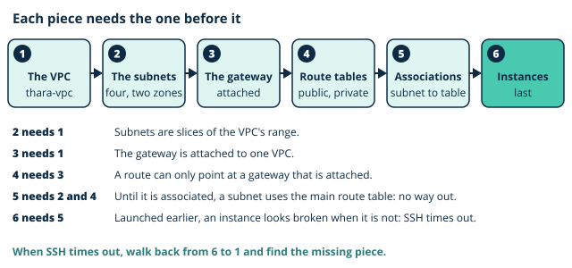

# Lab 3: Build the Thara network

**Day 3, afternoon session. Duration 3 hours. Builds component 4 (Thara VPC), component 5 (Bastion for Colombo IT) and component 6 (Portal web tier) of the Thara Hospitals architecture.**

| | |
|---|---|
| Learning outcomes | LO5, LO7 |
| Sub-outcomes | S5.4, S7.1, S7.3 |
| Prerequisites | From Day 2: the image `thara-portal-v1`, the key pair file `thara-key.pem` on your computer, and the stopped `thara-web-1` in the default VPC. From this morning: the agreed subnet plan |
| Estimated credit consumption | USD 0.40 |
| Evidence pack | Pack 3, due before the next teaching day |

## 0. Before you start

1. Region check: the console shows **Asia Pacific (Mumbai) ap-south-1**. If not, change it now.
2. You are signed in as your **admin IAM user**, not root.
3. Tags for everything today: `Module=CC`, `Day=3`, `Owner=<student id>`.
4. Open your cost ledger. Write today's date and the segment names below with a blank cost column.

Console labels below are as they appeared at the time of writing. AWS renames buttons from time to time; if a label differs, look for the same idea nearby and tell your lecturer.

You need a terminal with an SSH client on your own computer today: Terminal on macOS or Linux, PowerShell on Windows. Open it in the folder that holds `thara-key.pem`. On macOS or Linux, run `chmod 400 thara-key.pem` once, or SSH will refuse to use the file.

### The ideas behind today's lab

#### Build order matters

This morning you watched the wizard build a network in one click, and then watched the same network built by hand. This afternoon you build it by hand, because the order is the lesson. Each piece needs the one before it:

1. **The VPC**, because everything else is created inside it.
2. **The subnets**, because they are slices of the VPC's address range.
3. **The internet gateway, attached**, because a route can only point at a gateway that is attached to this VPC.
4. **The route tables**, because an association needs a table to point to.
5. **The associations**, because until a subnet is associated it quietly uses the main route table, which has no route to the internet.
6. **The instances**, last, because an instance launched into a subnet that is not yet routed looks broken when it is not.

A mis-ordered build is the commonest failure in this lab. The symptom is nearly always the same: an SSH connection that waits and then times out. When that happens, do not launch another instance. Walk back up this list and find the piece that is missing.



> **Quick check.** A student launches `thara-bastion` before `thara-public-rt` has its default route. The bastion has a public address, and `thara-bastion-sg` allows SSH from the student's IP. What happens when the student connects?
>
> - [x] The connection times out, because the subnet has no route to the internet
> - [ ] The connection opens, because the public address and the rule are in place
> - [ ] The connection is refused, because the instance was launched too early
>
> **Why:** Without the default route the bastion's reply has nowhere to go, so the student sees a timeout. A public address and a rule are not a path. Nothing is wrong with the instance, and launching it again would change nothing.

#### Names and tags

Every name today comes from Thara's naming table: `thara-vpc`, `thara-public-a`, `thara-public-b`, `thara-private-a`, `thara-private-b`, `thara-bastion`, `thara-web-1`. Type them exactly. Later days find these resources by name, and so does your marker. Everything you create carries `Module=CC`, `Day=3`, `Owner=<student id>`.

One thing is retired today. The `thara-web-1` you built on Day 2 has been waiting, stopped, in the default VPC as a fallback. In step 8 you launch a new `thara-web-1` from your image, inside your own network. Once it serves the pilot page, the image is proven and step 10 terminates the old server.

> **Quick check.** After step 8 the instance list shows two servers named `thara-web-1`. Which one does step 10 terminate, and how do you tell them apart?
>
> - [ ] The running one, because the stopped one is still the fallback
> - [ ] Whichever is listed first, because the two are the same server
> - [x] The stopped one tagged `Day=2`, which sits in the default VPC
>
> **Why:** A name is only a tag, and two resources can share it. The `Day` tag and the VPC tell them apart. The Day 2 server was the fallback until the image was proven, and step 9 proves it.

> **Common mistake.** "The private instance cannot be reached at all." It can, from inside the VPC. `thara-web-1` has no public address and no route to the internet, yet the bastion reaches it on its private address in step 9. Private means unreachable from outside, not unreachable.

> **Common mistake.** "A public IP alone makes an instance reachable." It needs the route too. In the break-it step the bastion keeps its public address, and nobody can reach it.

## 1. Objective

At the end of this lab you have `thara-vpc` with four subnets in two availability zones, routing, two security groups and a [flow log](../../glossary.md#flow-log), a [bastion](../../glossary.md#bastion) `thara-bastion` in a public subnet, and a new `thara-web-1` launched from your image in a private subnet: components 4, 5 and 6. Every later day builds inside this network, up to Day 7; it serves Thara's requirements for private administrative access from the Colombo IT office and for a web tier that is not exposed to the internet. Keep [thara-vpc-builder](artefacts/thara-vpc-builder.html) open beside the console: it shows what each step adds to the picture.

## 2. Timed segments

| Segment | Minutes | Cost note |
|---|---|---|
| VPC, subnets, IGW, route tables | 45 | nil |
| Bastion and private web instance | 35 | two `t3.micro`, about USD 0.022 per hour together, plus USD 0.005 per hour for the bastion's public IPv4 address |
| Security group experiments | 25 | nil |
| NACL experiment | 25 | nil |
| Flow Logs | 20 | negligible: a few kilobytes of log records |
| Ledger, teardown, evidence | 15 | nil |

Segments containing a NAT gateway, a load balancer or a database are created, used and deleted inside the segment. Do not carry them across the break. Today has none of those. A VPC, its subnets, route tables, gateway, security groups and network ACLs cost nothing. The two instances bill by the hour while they run, so they are stopped before you leave. Prices are for ap-south-1 at the time of writing.

## 3. Steps

Each step states what to do and what you should see. If you do not see it, stop and diagnose before moving on.

*Segment 1: VPC, subnets, IGW, route tables*

1. **Check where and who you are.** Confirm the region selector shows **Asia Pacific (Mumbai) ap-south-1** and the top bar shows `admin-<student id>`. *Expected:* both are correct.

2. **Create the VPC.** Open the VPC console, choose **Create VPC**, and for **Resources to create** choose **VPC only**. Name tag `thara-vpc`; **IPv4 CIDR manual input**, `10.0.0.0/16`; no IPv6 CIDR block; tenancy **Default**. Add the three tags and choose **Create VPC**. Then select the VPC, choose **Actions**, **Edit VPC settings**, tick **Enable DNS hostnames** and save. *Expected:* `thara-vpc` is listed with the range `10.0.0.0/16`, and its details show **DNS hostnames: Enabled**. Notice what arrived without your asking: a main route table, a default network ACL and a default security group.

3. **Create the four subnets.** Choose **Subnets**, **Create subnet**, and select `thara-vpc`. Use **Add new subnet** to create all four in one go, each with the three tags:

   | Subnet name | Availability Zone | IPv4 subnet CIDR block |
   |---|---|---|
   | `thara-public-a` | `ap-south-1a` | `10.0.1.0/24` |
   | `thara-public-b` | `ap-south-1b` | `10.0.2.0/24` |
   | `thara-private-a` | `ap-south-1a` | `10.0.11.0/24` |
   | `thara-private-b` | `ap-south-1b` | `10.0.12.0/24` |

   Then, for `thara-public-a` and `thara-public-b` only: select the subnet, **Actions**, **Edit subnet settings**, tick **Enable auto-assign public IPv4 address**, save. *Expected:* four subnets in `thara-vpc`, two in each zone. At this moment all four are private, whatever they are called: none has a route to the internet yet.

4. **Create and attach an internet gateway.** Choose **Internet gateways**, **Create internet gateway**. Leave the name tag empty and add the three tags; the VPC it is attached to identifies it. Create it, then choose **Actions**, **Attach to VPC**, select `thara-vpc` and choose **Attach internet gateway**. *Expected:* the gateway's state is **Attached** and its VPC column shows `thara-vpc`.

5. **Create the two route tables and associate the subnets.** Choose **Route tables**, **Create route table**: name `thara-public-rt`, VPC `thara-vpc`, the three tags. On its **Routes** tab choose **Edit routes**, **Add route**: destination `0.0.0.0/0`, target **Internet Gateway**, then your gateway. Save. On its **Subnet associations** tab choose **Edit subnet associations**, tick `thara-public-a` and `thara-public-b`, and save. Now create `thara-private-rt` in the same VPC with the three tags, add **no** route to it, and associate `thara-private-a` and `thara-private-b`. *Expected:* `thara-public-rt` shows two routes, `10.0.0.0/16` to **local** and `0.0.0.0/0` to an id beginning `igw-`. `thara-private-rt` shows one route, `10.0.0.0/16` to **local**. Each table lists two explicit subnet associations. Only now are the public subnets public.

6. **Create the two security groups.** Choose **Security groups**, **Create security group**. Name `thara-bastion-sg`, description `SSH from the IT office`, VPC `thara-vpc`. Add one inbound rule: type **SSH**, source **My IP**. Add the three tags and create it. Then create `thara-web-sg`, description `Portal web tier`, VPC `thara-vpc`, with two inbound rules: type **HTTP**, source **Anywhere-IPv4**; and type **SSH**, source **Custom**, choosing `thara-bastion-sg` from the list that appears when you click in the source box. Add the three tags. *Expected:* the SSH rule of `thara-web-sg` shows a source beginning `sg-`, not an address. That rule says "whatever wears the bastion's group", not "whatever has this address".

*Segment 2: Bastion and private web instance*

7. **Launch the bastion and connect to it.** In EC2 choose **Launch instances**. Name `thara-bastion`, with the three tags on **Instances** and **Volumes**. Amazon Linux, `t3.micro`, key pair `thara-key` (the existing one). Under **Network settings** choose **Edit**: VPC `thara-vpc`, subnet `thara-public-a`, **Auto-assign public IP** enabled, **Select existing security group**, `thara-bastion-sg`. Launch. When it is running with its status checks passed, note its **Public IPv4 address** and, in your own terminal:

   ```bash
   ssh -i thara-key.pem ec2-user@<bastion public IPv4 address>
   ```

   *Expected:* after you accept the host key, a prompt of the form `[ec2-user@ip-10-0-1-... ~]$`. The address in the prompt is the bastion's private address, in `thara-public-a`. If the connection waits and times out, walk back up the build order in section 0 before you touch the instance.

8. **Launch the web server from your image.** Choose **Launch instances** again. Name `thara-web-1`, with the three tags (`Day=3`) on **Instances** and **Volumes**. Under **Application and OS Images** choose **My AMIs**, **Owned by me**, and select `thara-portal-v1`. `t3.micro`, key pair `thara-key`. Under **Network settings**, **Edit**: VPC `thara-vpc`, subnet `thara-private-a`, **Auto-assign public IP** disabled, **Select existing security group**, `thara-web-sg`. No user data: the web server is already in the image. Launch. *Expected:* the instance is running with a **Private IPv4 address** of the form `10.0.11.x` and an empty **Public IPv4 address**. Note the private address.

9. **Reach the web server through the bastion.** Your laptop cannot reach `10.0.11.x`. The bastion can, and `thara-web-sg` allows SSH from the bastion's group. The private key must not be typed into the bastion, so use one of two methods, for today only. Day 5 discusses why neither is ideal.

   Method A, agent forwarding. Your own computer keeps the key and answers for it:

   ```bash
   exit                                  # leave the bastion first
   ssh-add thara-key.pem
   ssh -A ec2-user@<bastion public IPv4 address>
   ssh ec2-user@<web private address>    # typed on the bastion
   ```

   Method B, only if `ssh-add` reports that it cannot reach an agent (common on Windows without administrator rights). Copy the key to the bastion for today, and remove it in teardown:

   ```bash
   exit                                  # leave the bastion first
   scp -i thara-key.pem thara-key.pem ec2-user@<bastion public IPv4 address>:~/
   ssh -i thara-key.pem ec2-user@<bastion public IPv4 address>
   chmod 400 thara-key.pem               # typed on the bastion
   ssh -i thara-key.pem ec2-user@<web private address>
   ```

   On `thara-web-1`, and then back on the bastion, run:

   ```bash
   curl http://localhost                           # on thara-web-1
   curl -m 10 https://aws.amazon.com               # on thara-web-1
   exit                                            # back to the bastion
   curl http://<web private address>               # on the bastion
   ```

   *Expected:* the prompt on `thara-web-1` reads `[ec2-user@ip-10-0-11-... ~]$`. Both `curl` commands to the web server print the line containing **Thara Hospitals portal (pilot)**: a server you never configured is serving the page, so the image works. The `curl` to the internet prints nothing for ten seconds and then reports a timeout: the private subnet has no way out. Day 4 fixes that.

10. **Retire the Day 2 server.** In EC2, **Instances**, two servers are now named `thara-web-1`. Find the one that is **Stopped**, tagged `Day=2`, in the default VPC. Select it, **Instance state**, **Terminate (delete) instance**. When it shows **Terminated**, choose **Security groups** and delete the group named `launch-wizard-...` that the Day 2 launch created in the default VPC. *Expected:* one `thara-web-1` remains in the list of running instances, in `thara-vpc`. If you launched the Day 2 server through **Explore AWS**, this termination is what completes that activity; its credit can take a while to appear. Leave the default VPC itself alone.

*Segment 3: Security group experiments*

11. **Experiment: an address is not a group.** Make sure you are on the bastion, not on `thara-web-1`. Open `thara-web-sg`, **Edit inbound rules**, and change the source of the SSH rule from `thara-bastion-sg` to **My IP**. Save. On the bastion:

    ```bash
    ssh -o ConnectTimeout=10 ec2-user@<web private address>
    ```

    *Expected:* `Connection timed out`. Write down why before you read on. "My IP" is the public address of your own network. The bastion's packet arrives at `thara-web-1` from the bastion's private address, `10.0.1.x`, which no rule now allows. And your laptop, which the rule does allow, has no path to a private address. The rule lets in nobody. **Revert:** set the SSH source back to `thara-bastion-sg`, save, and repeat the command to confirm that it connects. Then `exit` back to the bastion.

*Segment 4: NACL experiment*

12. **Experiment: a firewall that forgets.** In the VPC console choose **Network ACLs**, **Create network ACL**: name `thara-strict-nacl`, VPC `thara-vpc`, the three tags. A new network ACL blocks everything, so add rules. On **Inbound rules**, **Edit inbound rules**, **Add new rule**:

    | Rule number | Type | Source | Allow or deny |
    |---|---|---|---|
    | 100 | HTTP (80) | `0.0.0.0/0` | Allow |
    | 110 | SSH (22) | `0.0.0.0/0` | Allow |

    On **Outbound rules**, **Edit outbound rules**, **Add new rule**:

    | Rule number | Type | Destination | Allow or deny |
    |---|---|---|---|
    | 100 | HTTP (80) | `0.0.0.0/0` | Allow |
    | 110 | HTTPS (443) | `0.0.0.0/0` | Allow |

    Now choose **Actions**, **Edit subnet associations**, tick `thara-public-a` and save. In a **new** terminal on your own computer:

    ```bash
    ssh -o ConnectTimeout=10 -i thara-key.pem ec2-user@<bastion public IPv4 address>
    ```

    *Expected:* `Connection timed out`, and your existing session on the bastion stops responding too. Inbound port 22 is allowed, so your packet arrives. The bastion's reply leaves from port 22 towards a high-numbered port on your side, and no outbound rule allows that. Add a third outbound rule: number 120, type **Custom TCP**, port range `1024-65535`, destination `0.0.0.0/0`, **Allow**. Repeat the command. *Expected:* it connects, and the stalled session wakes up. **Revert:** open `thara-strict-nacl`, **Actions**, **Edit subnet associations**, untick `thara-public-a` and save. The subnet returns to the VPC's default network ACL, which allows everything.

*Segment 5: Flow Logs*

13. **Record the traffic, then find two rejections.** Open CloudWatch, **Log groups**, **Create log group**: name `thara-flow-logs`, the three tags. Back in the VPC console choose **Your VPCs**, select `thara-vpc`, **Actions**, **Create flow log**. Filter **All**; maximum aggregation interval **1 minute**; destination **Send to CloudWatch Logs**; destination log group `thara-flow-logs`; for **Service access**, let the console create a new service role (the flow log needs permission to write to the log group, and Day 5 explains roles); log record format **AWS default format**; the three tags. Create it. Now make three attempts, noting the time:

    ```bash
    # 1. on your own computer: SSH to the web server's private address
    ssh -o ConnectTimeout=5 -i thara-key.pem ec2-user@<web private address>
    # 2. on your own computer: knock on the bastion at port 3389
    ssh -p 3389 -o ConnectTimeout=5 ec2-user@<bastion public IPv4 address>
    # 3. on the bastion: knock on the web server at port 3389
    ssh -p 3389 -o ConnectTimeout=5 ec2-user@<web private address>
    ```

    All three must fail. Wait five to ten minutes (write your ledger rows meanwhile). Then open CloudWatch, **Log groups**, `thara-flow-logs`, and choose **Search all log streams** (or open each log stream in turn: there is one for each network interface). Filter with `REJECT 3389`. *Expected:* two records of this shape, one for attempt 2 and one for attempt 3:

    ```text
    2 <account id> eni-0a1b... 203.0.113.25 10.0.1.25 51544 3389 6 1 52 1700000000 1700000050 REJECT OK
    2 <account id> eni-0c3d... 10.0.1.25 10.0.11.40 40312 3389 6 1 60 1700000100 1700000150 REJECT OK
    ```

    Read each one field by field against this morning's notes: source address, destination address, source port, destination port, protocol 6 (TCP), action. Two things to notice. In the first record the destination is the bastion's **private** address, because the internet gateway has already translated the public one. And attempt 1 has **no record at all**: a private address is not routable on the internet, so your packet never reached the VPC, and a flow log can only record what arrives at one of its network interfaces. If something did answer on that address, it was a machine on the network you are sitting in, not your instance.

*Segment 6: Ledger, teardown, evidence*

Write the ledger rows first (section 7), then do sections 4 and 5, then tear down (section 6), then collect the evidence (section 8).

## 4. Prove it

Paste the output of each into your evidence pack.

- On the bastion, `curl http://<web private address>` (an address of the form `10.0.11.x`) returns the line containing **Thara Hospitals portal (pilot)**. The web tier is reachable from inside the network.
- On `thara-web-1`, `curl -m 10 https://aws.amazon.com` times out. The web tier has no egress; Day 4 fixes this.
- In `thara-flow-logs`, two REJECT records, each annotated by you with its source, destination, port and action, and one line saying which rule was missing.

## 5. Break it

**Fault:** the bastion stops answering, although it still has a public address.

1. Open `thara-public-rt`, **Edit routes**, and remove the `0.0.0.0/0` route. Save.
2. From your own computer run `ssh -o ConnectTimeout=10 -i thara-key.pem ec2-user@<bastion public IPv4 address>`. **Symptom:** `Connection timed out`.
3. **Locate it** with what you already know. In EC2 the bastion is running, its status checks pass and it still shows a **Public IPv4 address**. Its security group still allows SSH from your IP. So look at the network: select `thara-public-a`, open its **Route table** tab, and read the routes. Only `10.0.0.0/16` to **local** is left. The subnet has nowhere to send a packet whose destination is on the internet, so the bastion's replies cannot leave. A public address is only a mapping held at the internet gateway; without the route, nothing in the subnet can use it.
4. **Fix:** add the route again (destination `0.0.0.0/0`, target your internet gateway), save, and connect.

Record the fault, the symptom, the evidence that located it and the fix in the table in section 4 of your evidence pack. Say in one sentence why a public address was not enough.

## 6. Teardown

Do these in order. Check your ledger rows are written first.

1. **If you used method B in step 9**, remove the key from the bastion: on the bastion, `rm ~/thara-key.pem`.
2. **Stop `thara-bastion` and `thara-web-1`**: **Instance state**, **Stop instance**. Do not terminate them. *Expected:* both show **Stopped**, and the bastion's public IPv4 address disappears.
3. **Delete `thara-strict-nacl`**, but only if it is not associated with any subnet: its **Subnet associations** tab must be empty. If `thara-public-a` is still listed, revert the association first (step 12).
4. **Confirm the Day 2 server is gone**: **Instances** shows it as **Terminated** or no longer lists it.

What you keep, and why:

| Kept | Why |
|---|---|
| `thara-vpc`, its four subnets, the internet gateway, `thara-public-rt` and `thara-private-rt` | Every later lab builds inside this network, up to Day 7. None of it costs anything |
| `thara-bastion-sg`, `thara-web-sg` and the VPC's default network ACL | The same |
| The flow log and `thara-flow-logs` | Day 7 uses the records to find faults. With both instances stopped it records almost nothing |
| `thara-bastion` and `thara-web-1`, stopped | Day 4 starts them again |
| AMI `thara-portal-v1`, the Day 2 data snapshot, the bucket and the inactive access key | As on Day 2 |
| `thara-key.pem`, on your computer | Every later connection needs it |

Two stopped instances are not free. Their two 8 GiB root volumes are still stored, at about USD 0.05 a day together at the time of writing. When you start the bastion on Day 4 it will have a **new** public address, and your own address may have changed too.

## 7. Cost line

Estimate for today: **USD 0.40**. That covers about two and a half hours of two `t3.micro` instances with one public IPv4 address (about USD 0.08) and roughly a week of the two stopped root volumes. Add one ledger row for each of: `thara-bastion` and `thara-web-1` (with start and stop times), the flow log, and the Day 2 server (terminated, with the time). Add one row with cost 0.00 for the network itself: `thara-vpc`, subnets, gateway, route tables and security groups. Write the day's total against the estimate. If it is higher than the estimate, write why in one line.

## 8. Evidence required

1. A diagram of `thara-vpc`, drawn by hand or with a tool, showing the four subnets with their ranges and zones, both route tables with their routes and associations, the internet gateway, and both instances.
2. One screenshot showing the routes of `thara-public-rt` and `thara-private-rt` side by side.
3. The two annotated REJECT records from `thara-flow-logs`.
4. Your ledger rows.
5. Your break-it row from section 5, with your sentence on why a public address was not enough.

Check every screenshot before you submit it: no private key, and the middle digits of your account id masked.

## 9. Thara connection

This lab meets two requirements and starts a third. The Head of IT asked for private administrative access from the Colombo IT office and no public path to what sits behind it: the bastion is the one door, `thara-bastion-sg` opens it to one address, and the web tier has no public address at all. The web tier must not be exposed to the internet: `thara-web-1` sits in a private subnet whose route table has no way out, which is also why it cannot yet be patched, and that is Day 4's problem. The Data Protection Officer's question, "how would we know?", gets its first answer: the flow log recorded two attempts that were refused, with who knocked and on which port. The Head of IT would ask what happens to administration if the bastion is lost. The CFO would ask what the network costs, and the answer is nothing: only what runs inside it does.
