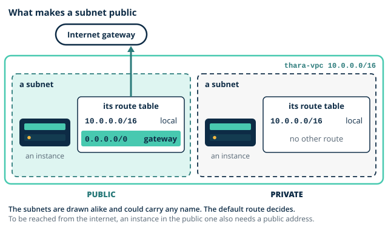
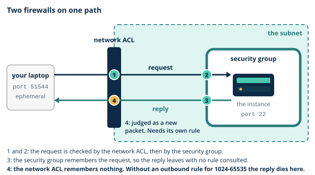

# Day 3 notes: VPC anatomy

These notes go with the morning slides. They build the ideas you need before this afternoon's lab, where you build component 4 (the Thara VPC), component 5 (the bastion for Colombo IT) and component 6 (the portal web tier) of the Thara architecture.

## Where you are starting

So far you have built components 1, 2 and 3: the guardrails, the portal web server with its image `thara-portal-v1`, and the laboratory reports bucket. The server ran in the default VPC, a network you did not design, behind a security group with three rules that you were told to treat as a firewall and no more. The image has never been launched. And you were asked to carve `10.0.0.0/16` into four subnets on paper.

Today the network becomes yours. You already know most of it: subnets, routing tables, default routes, NAT and firewalls are Year 1 material. What is new is that all of it is software, created in seconds and thrown away as easily. The morning names the parts and teaches you to predict where a packet will be stopped. The afternoon has you build the network by hand and test every prediction.

## 1. A VPC is a network you already know

**The VPC.** An Amazon [VPC](../../glossary.md#vpc) (Virtual Private Cloud) is a software-defined network that belongs to your account and lives in one region. You give it a range of private addresses as a CIDR block. Thara's is `thara-vpc`, `10.0.0.0/16`. Nothing gets in or out of it until you say so.

**Subnets.** A [subnet](../../glossary.md#subnet) is a slice of the VPC's range, and each subnet lives in exactly one availability zone. That is the difference from a VLAN on a campus: where a subnet sits decides which building its servers are in. Spreading a tier across two subnets in two zones is how you survive the loss of one. Thara has four: `thara-public-a` (`10.0.1.0/24`) and `thara-private-a` (`10.0.11.0/24`) in one zone, `thara-public-b` (`10.0.2.0/24`) and `thara-private-b` (`10.0.12.0/24`) in another.

**Route tables.** A [route table](../../glossary.md#route-table) is a list of rules: for this destination range, send the packet to that target. Every route table in a VPC starts with one route you cannot remove, the VPC's own range to **local**, which is why every subnet can reach every other subnet in the VPC without your doing anything. A subnet is associated with **exactly one** route table. If you do not associate it, it silently uses the VPC's **main route table**.

**The internet gateway.** An [internet gateway](../../glossary.md#internet-gateway) is the VPC's door to the internet. You create it, attach it to the VPC, and then nothing happens, because no route points at it yet. It also does a job you do not see: an instance only ever knows its private address, and the gateway translates between that and the instance's public address.

**What makes a subnet public.** A subnet is a [public subnet](../../glossary.md#public-subnet) when its route table has a default route, `0.0.0.0/0`, to an internet gateway. An instance in it is reachable from the internet when it also has a public address. Both are needed. The subnet's name plays no part.

| | Route table has `0.0.0.0/0` to the gateway | Instance has a public address | Reachable from the internet? |
|---|---|---|---|
| `thara-bastion` in `thara-public-a` | yes | yes | yes, if its security group allows it |
| `thara-web-1` in `thara-private-a` | no | no | no |
| An instance with a public address in a subnet with no such route | no | yes | no |



> **Quick check.** A colleague creates `thara-public-b` and forgets to associate it with `thara-public-rt`. An instance in it has a public address. Can a patient reach that instance?
>
> - [ ] Yes: the subnet is public and the instance has a public address
> - [x] No: the subnet is using the main route table, which has no route out
> - [ ] Yes, as soon as its security group allows HTTP from anywhere
>
> **Why:** A subnet that is not associated uses the main route table, and that table has no route to the internet gateway. The name and the public address change nothing, and a security group cannot supply a missing route.

**Public addresses.** A public address that AWS assigns automatically is borrowed: stop the instance and it is released, start it and you get a different one, as you saw in the Day 2 demonstration. An **[Elastic IP](../../glossary.md#elastic-ip)** is a public address that stays yours until you release it, so it survives a stop and can be moved from one instance to another. At the time of writing every public IPv4 address costs USD 0.005 an hour, in use or idle.

> **Quick check.** `thara-bastion` is stopped in teardown and started again on Day 4. The address the IT office saved no longer answers. Why?
>
> - [x] Its automatic public address was released when it stopped
> - [ ] Its key pair expired while the instance was stopped
> - [ ] Its security group went back to having no rules at all
>
> **Why:** An automatically assigned public address is borrowed and is replaced at the next start. An Elastic IP is the kind that stays. Key pairs do not expire, and stopping an instance changes nothing in its security group.

**The default VPC.** Every region comes with a [default VPC](../../glossary.md#default-vpc) so that a first instance works at once. Every subnet in it is public and gives each instance a public address. That is convenient for a first server and wrong for real work: there is no private tier, nothing was designed, and anything you launch is one careless security group rule away from the internet. From today, everything goes into `thara-vpc`.

> **You already know this.** VLANs, an L3 switch's routing table, and the edge router's default route. Subnets are the VLANs, a route table is the L3 switch's routing table, and the `0.0.0.0/0` route to the internet gateway is the default route on the edge router.

> **Thara.** `thara-vpc` is the Colombo basement rebuilt, with two "buildings": two availability zones, so that one flood cannot take both.

> **Common mistake.** "A subnet named public is public." A name is a label for people. Only a route to the internet gateway, plus a public address on the instance, makes anything reachable. Name a subnet `thara-public-b`, forget to associate it with the public route table, and it is private.

## 2. Two firewalls, two behaviours

A packet on its way to an instance passes two firewalls, and they behave differently.

| | Security group | Network ACL |
|---|---|---|
| Attached to | A network interface, so in effect an instance | A subnet |
| State | **Stateful**: a reply to allowed traffic is allowed automatically | **Stateless**: every packet is judged alone, replies included |
| Rules | Allow only. What is not allowed is dropped | Allow and deny |
| Evaluation | All rules together: if any rule allows it, it passes | In numbered order, lowest first; the first match decides |
| Return traffic | Nothing to write | Needs its own rule, for the ephemeral ports |

**Security groups.** You met these on Day 2. A [security group](../../glossary.md#security-group) holds allow rules only, and they are evaluated as a whole: there is no order, and no rule can cancel another. It is stateful, so when a request is allowed in, its reply goes out without a rule.

**Network ACLs.** A [network ACL](../../glossary.md#network-acl) (access control list) guards a whole subnet. Its rules are numbered and tried from the lowest number up; the first one that matches decides, and a final rule, shown as `*`, denies whatever is left. It is stateless. It does not remember that it let a request in, so the reply is judged as a new packet against the rules for the other direction.



**The reply, and ephemeral ports.** When your laptop opens an SSH connection, it sends from a temporary, high-numbered port that it picks for that one connection: an [ephemeral port](../../glossary.md#ephemeral-port). The server's reply goes from port 22 back to that port. A security group never notices. A network ACL must have an outbound rule that allows the range those ports come from, `1024-65535`, or the reply dies at the edge of the subnet and the connection times out. Try it in [sg-vs-nacl](artefacts/sg-vs-nacl.html) before you do it for real this afternoon.

> **Quick check.** Someone puts a network ACL on `thara-public-a` that allows inbound 22 and 80, and outbound 80 and 443. SSH to the bastion now times out. Where does the connection die?
>
> - [ ] At the inbound rules, which do not cover SSH
> - [ ] At the security group, which has lost its rule
> - [x] At the outbound rules, when the reply leaves
>
> **Why:** Inbound 22 is allowed, so the request arrives. The reply travels to an ephemeral port on your laptop, and no outbound rule allows that range. The security group is untouched, and being stateful it would let the reply out anyway.

**Why both exist, and where each fails.** A security group is precise: it follows the instance and says exactly who may talk to it. But it cannot deny. If one address range must be blocked whatever the groups say, only a network ACL can do that, for the whole subnet at once. A network ACL is a blunt second layer: it cannot tell one instance in a subnet from another, it does not see traffic that stays inside the subnet, and it fails in exactly the way above when someone forgets the return rule. In this module the network ACLs stay open and the security groups do the work.

**A group as a source.** A security group rule can name another security group as its source, instead of an address range. "Allow SSH from `thara-bastion-sg`" means: from any instance that wears that group, whatever its address is today. This is how tiers are chained. The bastion is reachable from one address, the web tier accepts SSH only from the bastion's group, and on Day 6 the database will accept connections only from the web tier's group.

> **Quick check.** The records database must accept connections only from the web tier, whose instances will be replaced many times on Day 7. Which source should its rule name?
>
> - [ ] The private address of each web instance
> - [ ] The address ranges of both private subnets
> - [x] The security group that the web tier wears
>
> **Why:** A group as a source follows membership, so a replaced instance is covered the moment it wears `thara-web-sg`. Addresses go stale with every replacement, and a subnet range admits everything else that lives in the subnet.

> **You already know this.** A stateful firewall versus a router ACL. The firewall tracks connections and lets replies back by itself. The router ACL is a numbered list checked top down, and you write the return entry yourself. A security group is the firewall. A network ACL is the router ACL.

> **Thara.** The bastion should be reachable only from the IT office; the database only from the web tier. The first is a security group rule with one address as its source. The second is a rule with a group as its source.

> **Common mistake.** "Security groups can deny." They cannot. A security group has allow rules only, and the absence of an allow is the deny. If you need to block one specific range, that is a job for a network ACL.

> **Common mistake.** "Network ACLs are stateful." They are not. Allowing a request in says nothing about its reply, which needs its own rule in the other direction.

## 3. Seeing the traffic

**Flow Logs.** A VPC [Flow Log](../../glossary.md#flow-log) records the traffic that reaches or leaves the network interfaces of a VPC. It does not record what was said, only who talked to whom: one record for each flow in each capture window. A record in the default format looks like this:

```text
2 <account id> eni-0a1b... 203.0.113.25 10.0.1.25 51544 22 6 20 4249 1700000000 1700000050 ACCEPT OK
```

| Field | In this record | Meaning |
|---|---|---|
| Interface | `eni-0a1b...` | The network interface where the traffic was seen |
| Source and destination address | `203.0.113.25`, `10.0.1.25` | Who sent it, and to whom |
| Source and destination port | `51544`, `22` | An ephemeral port on the client, SSH on the server |
| Protocol | `6` | TCP (17 is UDP, 1 is ICMP) |
| Packets and bytes | `20`, `4249` | How much traffic the record covers |
| Start and end | two numbers | The capture window, as timestamps |
| Action | `ACCEPT` | The verdict of the security group and the network ACL |

**ACCEPT and REJECT.** The action says whether the two firewalls let the traffic pass. `REJECT` means that a security group or a network ACL refused it. A dropped packet is silent for the sender, who sees only a timeout, but it is not silent for you. Each interface records its own verdict, so one packet can be an ACCEPT where it leaves and a REJECT where it arrives.

> **Quick check.** The Data Protection Officer asks whether an attempt to connect to the bastion on port 3389, which no rule allows, left any trace. What do you answer?
>
> - [ ] No: the security group drops the packet silently
> - [x] Yes: a REJECT record, with the address it came from
> - [ ] Yes: an ACCEPT record, because the packet arrived
>
> **Why:** The drop is silent only for the sender. The flow log records the attempt at the bastion's interface as a REJECT, with its source address and port. ACCEPT would mean that the firewalls let it through.

**Where the records go.** Today's flow log is delivered to **Amazon CloudWatch Logs**, into a log group, with one log stream for each network interface. This is your first use of CloudWatch, the service that collects what your resources report about themselves. Day 7 returns to it for metrics and alarms.

**VPC DNS.** Every VPC has a DNS resolver at the base of its range plus two. For `thara-vpc` that is `10.0.0.2`. Instances use it without any configuration. With DNS hostnames enabled on the VPC, each instance also gets a private DNS name, which is why the lab switches that setting on.

> **You already know this.** NetFlow export to a collector. A router summarises each conversation it forwards and sends the summary to a collector, where you search it later. A flow log is the summary; CloudWatch Logs is the collector.

> **Thara.** The Data Protection Officer's "how would we know?" begins with flow logs. If someone tries the bastion's door, the attempt is on record, with the address it came from and the port it tried.

## Predict the packet path

Before the lab you trace three packets on paper, in class, on a printed diagram of `thara-vpc`. For each one, mark every hop and every table or rule that is consulted, in order: internet gateway, route table, network ACL, security group, instance. Then check yourself in [packet-path-predictor](artefacts/packet-path-predictor.html).

| Trace | The question |
|---|---|
| A patient's browser requests the pilot page from `thara-web-1`, and the reply returns | Which hops and which checks does each direction pass? |
| An SSH attempt from a random internet address to the bastion | Where is it stopped, and by which of the two firewalls? |
| A reply to an allowed inbound connection, through a network ACL that lacks the ephemeral ports | Where does it die? |

The first trace has a catch. As the network stands at the end of today, a patient cannot reach `thara-web-1` at all, and you should be able to say why before the lab. Day 7 gives patients a way in that does not put the web tier on the internet.

## Before the lab

- Find `thara-key.pem`. Without it you cannot reach the bastion, and AWS will not give you a second copy.
- You need an SSH client in a terminal on your own computer: Terminal on macOS or Linux, PowerShell on Windows.
- Have your subnet plan in front of you. The lab uses the four subnets agreed this morning.
- Open [thara-vpc-builder](artefacts/thara-vpc-builder.html) and find components 4, 5 and 6. Each one tells you which lab step builds it.
- Open your cost ledger. The network itself is free. The estimate for the day is USD 0.40, for two small instances and what they leave stored.

## Reading

- AWS, *Amazon VPC User Guide*, "Security groups" and "Network ACLs".
- For Day 4: AWS, *Amazon VPC User Guide*, "NAT gateways", "VPC peering basics" and "Gateway endpoints".

Self-check: CLF-C02 bank, Domain 3 networking set A (15 items) and set B (15 items), issued separately. Practice question: [PQ3](../../practice/PQ3.md).

Task for Day 4: write one paragraph on why VPC peering is non-transitive, and what that forces a hospital group with five sites to do.
