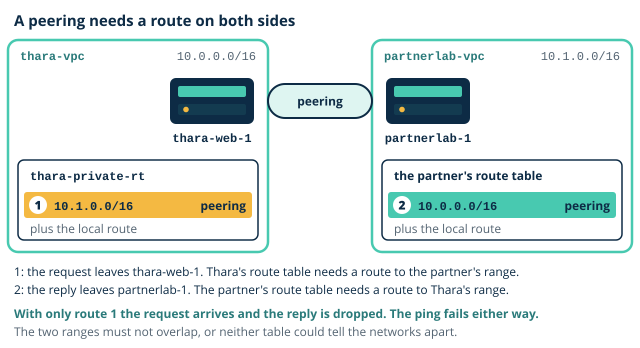

# Lab 4: Egress, endpoint and the partner laboratory

**Day 4, afternoon session. Duration 3 hours. Builds component 7 (NAT gateway), component 8 (S3 gateway endpoint) and component 9 (Partner diagnostic laboratory VPC) of the Thara Hospitals architecture.**

| | |
|---|---|
| Learning outcomes | LO5, LO7 |
| Sub-outcomes | S5.4, S7.2 |
| Prerequisites | From Day 3: `thara-vpc` with its subnets and route tables, and `thara-bastion` and `thara-web-1`, both stopped. From Day 2: the bucket `thara-reports-<student id>`, the inactive access key and its `.csv` file. On your computer: `thara-key.pem` |
| Estimated credit consumption | USD 1.50 |
| Evidence pack | Pack 4, due before the next teaching day |

## 0. Before you start

1. Region check: the console shows **Asia Pacific (Mumbai) ap-south-1**. If not, change it now.
2. You are signed in as your **admin IAM user**, not root.
3. Tags for everything today: `Module=CC`, `Day=4`, `Owner=<student id>`.
4. Open your cost ledger. Write today's date and the segment names below with a blank cost column.

Console labels below are as they appeared at the time of writing. AWS renames buttons from time to time; if a label differs, look for the same idea nearby and tell your lecturer.

You need the same terminal as on Day 3, opened in the folder that holds `thara-key.pem`, and the `.csv` file of the access key you created on Day 2.

### The ideas behind today's lab

#### Timed builds

Until today nothing you built could hurt you if you forgot it for an hour. Today one thing can. Three rules apply to the whole afternoon.

- **The NAT gateway bills from the moment it is created**, not from the moment you use it: about USD 0.056 for every hour it exists in ap-south-1, plus USD 0.056 for each gigabyte that passes through it, at the time of writing. So it is created, used and deleted inside one segment. Segment 1 is that window, and your ledger records how many minutes it stayed open.
- **The Elastic IP bills while it is yours**, attached or not, at USD 0.005 an hour. A NAT gateway needs one. Deleting the gateway hands the address back to you, not back to AWS, so you release it in the same segment.
- **Everything today is tagged `Day=4`**, including the things you delete before you leave. The tags are how Day 7 shows what today cost.

Two things today carry no name, only the three tags: the NAT gateway and the Elastic IP, and later the endpoint and the peering connection. There is one of each, so the console's type column identifies it. The partner laboratory's network is `partnerlab-vpc` and its server is `partnerlab-1`, from Thara's naming table.

One thing from Day 2 comes back for a few minutes. The image `thara-portal-v1` was made before the access key was typed in, so `thara-web-1` holds no credentials. In step 8 you switch the Day 2 key on and type it into `thara-web-1` once more, to prove that the bucket can be reached without the internet. It is still the insecure method, and it is switched off again in teardown. Day 5 replaces it for good.



> **Quick check.** You delete the NAT gateway at the end of segment 1, see it reach **Deleted**, and go home. What is still on the bill tomorrow?
>
> - [ ] Nothing: deleting the gateway removes everything that came with it
> - [ ] The gateway itself, which bills until the end of the day
> - [x] The Elastic IP, which stays in your account until you release it
>
> **Why:** Deleting the gateway only detaches its address. An Elastic IP bills by the hour for as long as it is yours, attached or idle, so step 7 releases it. A deleted gateway stops billing at once.

> **Quick check.** In step 14 the ping to `partnerlab-1` reports 100% packet loss. The peering connection is **Active**, and `thara-private-rt` has its route to `10.1.0.0/16`. Where do you look next?
>
> - [ ] At the peering connection, which must be accepted a second time
> - [x] At the partner's route table, which has no route back to `10.0.0.0/16`
> - [ ] At `thara-web-sg`, which has no inbound rule for ICMP
>
> **Why:** The request arrives, and the reply has no route home. A reply to a connection that `thara-web-1` started needs no inbound rule, because a security group is stateful, and a connection that is Active has already been accepted.

> **Common mistake.** "Deleting the NAT gateway releases the Elastic IP." It does not. The address goes back to your account, idle, and bills until you release it. Step 7 does both, in that order.

> **Common mistake.** "One side's route is enough for peering." It is not. A route on Thara's side sends the request. The reply needs a route of its own in the partner's table. Steps 14 and 15 show the difference.

## 1. Objective

At the end of this lab the private web tier has been patched through a [NAT gateway](../../glossary.md#nat-gateway) that no longer exists, `thara-web-1` reaches the laboratory reports bucket through a [gateway endpoint](../../glossary.md#gateway-endpoint) that stays, and a partner network has been [peered](../../glossary.md#vpc-peering) to `thara-vpc`, tested from both sides and withdrawn: components 7, 8 and 9. The endpoint persists, and Day 5 reads the bucket through it; the lab serves Thara's requirements that the web tier is patched without being exposed to the internet and that the partner diagnostic laboratory can send results into the system. Keep [thara-vpc-builder](artefacts/thara-vpc-builder.html) open beside the console: it shows what each step adds to the picture, and what is gone by the end.

## 2. Timed segments

| Segment | Minutes | Cost note |
|---|---|---|
| NAT gateway create, use, delete | 50 | about USD 0.056 per hour plus USD 0.056 per GB, plus USD 0.005 per hour for its public IPv4 address; target under USD 0.10 |
| S3 gateway endpoint | 30 | free |
| Partner VPC and peering | 55 | one extra `t3.micro` for the segment, about USD 0.011 per hour |
| Ledger, teardown, evidence | 30 | nil |

Segments containing a NAT gateway, a load balancer or a database are created, used and deleted inside the segment. Do not carry them across the break. Today that means segment 1: if a break falls inside it, finish step 7 first. The two Thara instances also bill by the hour while they run, as on Day 3, so they are stopped before you leave. Prices are for ap-south-1 at the time of writing.

## 3. Steps

Each step states what to do and what you should see. If you do not see it, stop and diagnose before moving on.

*Segment 1: NAT gateway create, use, delete*

1. **Check where and who you are.** Confirm the region selector shows **Asia Pacific (Mumbai) ap-south-1** and the top bar shows `admin-<student id>`. *Expected:* both are correct.

2. **Start the two instances and reopen the door.** In EC2, **Instances**, select `thara-bastion` and `thara-web-1`, then **Instance state**, **Start instance**. The bastion comes back with a **new** public address, and your own address may have changed since Day 3. So open **Security groups**, `thara-bastion-sg`, **Edit inbound rules**, set the source of the SSH rule to **My IP** again, and save. Note the bastion's new **Public IPv4 address**, connect to it, and hop to `thara-web-1` with the method you used in step 9 of the Day 3 lab:

   ```bash
   ssh-add thara-key.pem
   ssh -A ec2-user@<bastion public IPv4 address>
   ssh ec2-user@<web private address>    # typed on the bastion
   ```

   *Expected:* a prompt on `thara-web-1` of the form `[ec2-user@ip-10-0-11-... ~]$`. If the first connection waits and times out, check the SSH source of `thara-bastion-sg` before anything else. The network has not changed since Day 3.

3. **Confirm that there is still no way out.** On `thara-web-1`:

   ```bash
   curl -m 10 -I https://aws.amazon.com
   ```

   *Expected:* nothing for ten seconds, then a timeout. This is where Day 3 ended. In the VPC console open **Route tables**, `thara-private-rt`, and take a screenshot of its **Routes** tab: one route, `10.0.0.0/16` to **local**. That is your "before".

4. **Allocate an Elastic IP and create the NAT gateway.** In the VPC console choose **Elastic IPs**, **Allocate Elastic IP address**. Leave the settings as they are, add the three tags and choose **Allocate**. Write the time in your ledger: the address bills from now. Then choose **NAT gateways**, **Create NAT gateway**. Leave the name empty. If the page asks for an **Availability mode**, choose **Zonal**. Subnet `thara-public-a`; connectivity type **Public**; for **Elastic IP allocation ID** choose the address you have just allocated; add the three tags; choose **Create NAT gateway**. Write the time in your ledger. *Expected:* the state is **Pending** and becomes **Available** within a few minutes. The gateway sits in a **public** subnet on purpose: it needs the internet gateway's route itself, so that the private subnets do not.

5. **Give the private subnets a default route.** Open **Route tables**, `thara-private-rt`, **Routes**, **Edit routes**, **Add route**: destination `0.0.0.0/0`, target **NAT Gateway**, then your gateway. Save. *Expected:* two routes, `10.0.0.0/16` to **local** and `0.0.0.0/0` to an id beginning `nat-`. Take a screenshot. Compare it with `thara-public-rt`: both tables now have a default route, and only the target differs.

6. **Use the window.** On `thara-web-1`:

   ```bash
   curl -m 10 -I https://aws.amazon.com
   curl -s https://checkip.amazonaws.com
   sudo dnf clean metadata
   sudo dnf -y update
   ```

   *Expected:* the first command prints a status line beginning `HTTP/`. The second prints the address that the internet sees for `thara-web-1`: it is your Elastic IP, the NAT gateway's address, not an address of the instance, which still has none. The update ends with `Complete!` or `Nothing to do.`; either means that the server reached its package repositories. The web tier has been patched, and nothing on the internet could have started a connection to it.

7. **Close the window.** Do these in order. Open `thara-private-rt`, **Edit routes**, remove the `0.0.0.0/0` route and save. Choose **NAT gateways**, select yours, **Actions**, **Delete NAT gateway**, type `delete` and confirm. Wait until its state is **Deleted**; this takes a minute or two, and the address cannot be released before then. Then choose **Elastic IPs**, select the address, **Actions**, **Release Elastic IP addresses**, **Release**. Write both times in your ledger, with the minutes the gateway existed. On `thara-web-1` run the first `curl` of step 6 once more. *Expected:* the list of Elastic IPs is empty; the NAT gateway shows **Deleted** (the line stays visible for about an hour and costs nothing); `thara-private-rt` is back to one route; and the `curl` times out again.

*Segment 2: S3 gateway endpoint*

8. **Switch the Day 2 key on, and find that it is not enough.** Read "The ideas behind today's lab" in section 0 again. Open IAM, **Users**, `admin-<student id>`, **Security credentials**, **Access keys**, and for the Day 2 key choose **Actions**, **Activate**. On `thara-web-1`:

   ```bash
   aws configure
   # AWS Access Key ID: from the .csv file
   # AWS Secret Access Key: from the .csv file
   # Default region name: ap-south-1
   # Default output format: json
   clear
   aws s3 ls s3://thara-reports-<student id> --cli-connect-timeout 5
   ```

   *Expected:* after a pause of up to half a minute, an error containing `Connect timeout on endpoint URL`. The key is valid and the bucket exists. The request never arrived: S3 is a public service, and the private subnets have no path to it. Type the region exactly: with a different region, or none, the command looks for S3 somewhere that today's endpoint does not cover.

9. **Create the gateway endpoint.** In the VPC console choose **Endpoints**, **Create endpoint**. Leave the name empty. Type **AWS services**. Under **Services**, add the filter **Type = Gateway** and select `com.amazonaws.ap-south-1.s3`. VPC `thara-vpc`. Under **Route tables**, tick `thara-private-rt` and nothing else. Policy **Full access**. Add the three tags and choose **Create endpoint**. *Expected:* the endpoint shows **Available**. Open `thara-private-rt` again: it has a second route that you did not write, whose destination begins `pl-` and whose target begins `vpce-`. The destination is a prefix list, the address ranges of S3 in Mumbai, kept up to date by AWS. Take a screenshot.

10. **Reach the bucket with no internet path.** On `thara-web-1`:

    ```bash
    aws s3 ls s3://thara-reports-<student id>
    curl -m 10 -I https://aws.amazon.com
    ```

    *Expected:* the first command lists `reports-index.txt`, the file you uploaded on Day 2. The second still times out. The web tier can read the reports bucket and cannot reach the internet: there is no NAT gateway, no default route and no public address anywhere in this path. Leave the key active for now; sections 4 and 5 need it, and teardown switches it off. One more observation, for your notes: run `sudo dnf check-update` and write down whether it answers. Amazon Linux keeps its own package repositories in S3 in your region, so it may. Software from anywhere else still needs the NAT gateway.

*Segment 3: Partner VPC and peering*

11. **Create the partner laboratory's network.** In the VPC console choose **Create VPC**, **VPC only**: name tag `partnerlab-vpc`, IPv4 CIDR `10.1.0.0/16`, the three tags. Then **Subnets**, **Create subnet**: VPC `partnerlab-vpc`, no subnet name, Availability Zone `ap-south-1a`, IPv4 subnet CIDR block `10.1.1.0/24`, the three tags. *Expected:* select the new subnet and open its **Route table** tab: it is using the main route table of `partnerlab-vpc`, with one route, `10.1.0.0/16` to **local**. You did not associate it, so the main route table took it, as Day 3 said it would. Today that is what you want.

12. **Launch the partner's server.** In EC2 choose **Launch instances**. Name `partnerlab-1`, with the three tags on **Instances** and **Volumes**. Amazon Linux, `t3.micro`. For **Key pair** choose **Proceed without a key pair**: nobody will log in to this server. Under **Network settings** choose **Edit**: VPC `partnerlab-vpc`, the subnet you created, **Auto-assign public IP** disabled, **Create security group** with the name the page offers. Change its one inbound rule: type **All ICMP - IPv4**, source **Custom**, `10.0.0.0/16`. Launch. *Expected:* the instance is running with a **Private IPv4 address** of the form `10.1.1.x` and no public address. Note the private address. Its security group admits ping from Thara's range and nothing else.

13. **Create the peering connection and accept it.** In the VPC console choose **Peering connections**, **Create peering connection**. Leave the name empty. **VPC ID (Requester)** `thara-vpc`; **Account** My account; **Region** This Region; **VPC ID (Accepter)** `partnerlab-vpc`; the three tags; **Create peering connection**. Then **Actions**, **Accept request**, and confirm. If the console offers to modify your route tables, decline: you do that by hand. On `thara-web-1`:

    ```bash
    ping -c 3 -W 2 <partner private address>
    ```

    *Expected:* the connection's status is **Active**, and the ping reports `100% packet loss`. A peering connection is a link that nothing uses until a route points at it.

14. **Add the route on Thara's side only.** Open `thara-private-rt`, **Edit routes**, **Add route**: destination `10.1.0.0/16`, target **Peering Connection**, then your connection. Save, take a screenshot, and repeat the ping. *Expected:* a route to an id beginning `pcx-`, and still `100% packet loss`. Write down why before you read on. The request now leaves `thara-vpc` and arrives at `partnerlab-1`, whose security group allows it. The reply is addressed to `10.0.11.x`, and the partner's route table has no route for that range, so the reply is dropped inside the partner's network. Keep this output for your evidence.

15. **Add the partner's side, then take it away again.** Open **Route tables** and find the main route table of `partnerlab-vpc` (its **VPC** column names it). **Edit routes**, **Add route**: destination `10.0.0.0/16`, target **Peering Connection**, your connection. Save and repeat the ping. *Expected:* `3 packets transmitted, 3 received, 0% packet loss`. Now remove that one route from the partner's table and ping again: `100% packet loss` returns. Add the route back and confirm that the ping works. Keep both outputs. Both tables must carry a route, and the two networks' ranges must not overlap, or neither table could tell them apart.

*Segment 4: Ledger, teardown, evidence*

Write the ledger rows first (section 7), then do sections 4 and 5, then tear down (section 6), then collect the evidence (section 8).

## 4. Prove it

Paste the output of each into your evidence pack.

- Your saved output from step 6: the `curl` to the internet and the package update both succeeded through the NAT gateway. From step 7: the same `curl` timed out again once the route was removed.
- On `thara-web-1`, `aws s3 ls s3://thara-reports-<student id>` succeeds now, while `thara-private-rt` has no default route. Show the listing and the route table together.
- Your saved outputs from steps 14 and 15: the ping to `10.1.1.x` succeeds only when both route tables carry the peering route.

## 5. Break it

**Fault:** the bucket listing stops working, although the endpoint is still there and still shows **Available**.

1. In the VPC console choose **Endpoints**, select your endpoint, **Actions**, **Manage route tables**. Untick `thara-private-rt`, tick `thara-public-rt`, and choose **Modify route tables**.
2. On `thara-web-1` run `aws s3 ls s3://thara-reports-<student id> --cli-connect-timeout 5`. **Symptom:** `Connect timeout on endpoint URL`.
3. **Locate it** with what you already know. Nothing looks broken: the endpoint is **Available**, the key is active, the bucket exists. So ask the Day 3 question: where does this subnet send the packet? Select `thara-private-a`, open its **Route table** tab and read the routes. Only `10.0.0.0/16` to **local** is left. The `pl-` route has moved to `thara-public-rt`. An endpoint is nothing more than a route, and a subnet whose route table does not carry it has no path to S3.
4. **Fix:** **Manage route tables** again, tick `thara-private-rt`, untick `thara-public-rt`, save, and repeat the listing until it works.

Record the fault, the symptom, the evidence that located it and the fix in the table in section 4 of your evidence pack. Say in one sentence why an endpoint that shows **Available** was not enough.

## 6. Teardown

Do these in order. Check your ledger rows are written first.

1. **Deactivate the Day 2 access key**: IAM, your admin user, **Security credentials**, the key's **Actions**, **Deactivate**. *Expected:* status **Inactive**. The credentials file stays on `thara-web-1` until Day 5 and is useless while the key is off.
2. **Confirm that segment 1 left nothing behind**: **NAT gateways** shows yours as **Deleted** or no longer lists it, and **Elastic IPs** is empty. Both facts are in your ledger with their times.
3. **Withdraw the partner laboratory.** Open `thara-private-rt` and remove the `10.1.0.0/16` route. Choose **Peering connections**, select yours, **Actions**, **Delete peering connection**. In EC2 select `partnerlab-1`, **Instance state**, **Terminate (delete) instance**, and wait for **Terminated**. Then in the VPC console choose **Your VPCs**, select `partnerlab-vpc`, **Actions**, **Delete VPC**; the console lists the subnet, the route table and the security group that go with it. *Expected:* `thara-private-rt` shows exactly two routes, the local route and the `pl-` route, and neither is marked **Blackhole**.
4. **If you copied the key to the bastion today**, remove it: on the bastion, `rm ~/thara-key.pem`.
5. **Stop `thara-bastion` and `thara-web-1`**: **Instance state**, **Stop instance**. Do not terminate them. *Expected:* both show **Stopped**.

What you keep, and why:

| Kept | Why |
|---|---|
| The S3 gateway endpoint, associated with `thara-private-rt` | Day 5 reads the reports bucket through it. It costs nothing |
| `thara-vpc` and everything Day 3 built in it | Every later lab builds inside this network, up to Day 7 |
| `thara-bastion` and `thara-web-1`, stopped | Day 5 starts them again |
| The access key, inactive, and its `.csv` file | Day 5 deletes the key |

A route whose target has been deleted is not removed for you. It stays in the table, marked **Blackhole**, and silently drops whatever matches it. That is why the routes come out before the things they point at.

## 7. Cost line

Estimate for today: **USD 1.50**. The afternoon itself comes to about USD 0.15: about fifty minutes of NAT gateway (about USD 0.05), two `t3.micro` instances for three hours and a third for one hour (about USD 0.08), and the public IPv4 addresses of the bastion and the NAT gateway (about USD 0.02). About a week of the two stopped root volumes adds USD 0.35. The rest is margin, because today's risk is a gateway left running: each extra hour is about USD 0.06, and a week of it would be about USD 9.40.

Add one ledger row for each of: the Elastic IP (allocated and released, with times), the NAT gateway (created and deleted, with the minutes it existed), the gateway endpoint (cost 0.00), `partnerlab-1` (launched and terminated), the peering connection (cost 0.00), and `thara-bastion` and `thara-web-1` (start and stop times). Write the day's total against the estimate. If it is higher than the estimate, write why in one line.

## 8. Evidence required

1. Four screenshots of the routes of `thara-private-rt`: before any change (step 3), with the NAT route (step 5), with the endpoint's route (step 9), and with the peering route (step 14).
2. Your ledger rows for the NAT gateway and the Elastic IP, showing when each was created and removed and the elapsed minutes.
3. The ping output without the partner-side route and with it (steps 14 and 15).
4. The outputs listed in section 4.
5. Your break-it row from section 5, with your sentence on why **Available** was not enough.

Check every screenshot before you submit it: no secret access key, no private key, and the middle digits of your account id masked.

## 9. Thara connection

This lab meets one requirement in two ways and tests a third. The web tier must be patched without being exposed to the internet: the NAT gateway gave it a way out for fifty minutes and no way in, and the endpoint gives it a permanent path to the one service it needs every day. The laboratory reports never crossed the internet on their way to the web tier, which is what the Data Protection Officer will ask about first. The partner diagnostic laboratory sends results into the system: a peering connection carries them between two private networks, and you have shown both how to open it and how to withdraw it cleanly, route first. The CFO would ask how many hours the NAT gateway ran this month and who decided when to delete it; your ledger row is the answer. The Head of IT would ask what the partner's network can now reach inside Thara's, and the answer is whatever the routes and the security groups allow, and nothing more.
