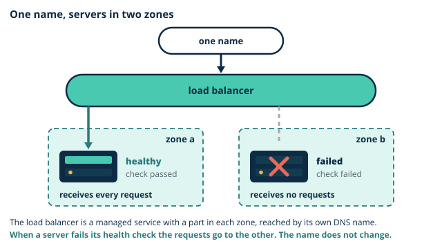

# Day 4 notes: Beyond a VPC: egress, peering, hybrid, edge

These notes go with the morning slides. They build the ideas you need before this afternoon's lab, where you build component 7 (the NAT gateway), component 8 (the S3 gateway endpoint) and component 9 (the partner diagnostic laboratory VPC) of the Thara architecture. The morning also introduces component 13, the edge and the branches, as ideas that Day 7 returns to.

## Where you are starting

So far you have built components 1 to 6. On Day 3 you built `thara-vpc` by hand, put `thara-bastion` in a public subnet as the one door for administrators, and launched `thara-web-1` from your image into a private subnet. Then you proved two things about that web server: the bastion can reach it, and it can reach nothing outside. Its `curl` to the internet timed out, and the lab sheet said "Day 4 fixes that".

A network with no way out is safe and not yet useful. The web tier has to fetch its patches. It has to read the laboratory reports, which live in S3, outside the VPC. A partner laboratory has to send results in. Four branch hospitals are waiting to be connected, and patients have to find the portal by a name. Every one of these is a question about a path, and each has a different right answer with a different price. The morning sorts them out. The afternoon builds three of them and takes two of them down again.

## 1. Getting out without being reachable

**The problem.** `thara-web-1` has no public address and its subnet has no route to the internet gateway. Giving it both would solve patching and undo Day 3. What it needs is a path on which it can start a conversation and nobody outside can.

**The NAT gateway.** A [NAT gateway](../../glossary.md#nat-gateway) is a managed service that sits in a **public** subnet and holds an Elastic IP. Private subnets send their default route to it. When `thara-web-1` opens a connection to the internet, the NAT gateway replaces the instance's private address with its own public one, remembers the conversation, and passes the reply back. Nothing outside can start a connection through it, because there is nothing to translate an unexpected packet to.

- It is **managed**: there is no instance for you to patch, and it scales by itself.
- It lives in **one availability zone**. This module uses that zonal mode. A design that must survive the loss of a zone needs one in each zone, or the newer regional mode that spans zones.
- It is **billed from the moment it exists**: by the hour, and again for every gigabyte that passes through it. In ap-south-1, at the time of writing, that is about USD 0.056 an hour and USD 0.056 a gigabyte, plus USD 0.005 an hour for its public address. Left running for a month it costs about USD 41, more than a quarter of Thara's whole ceiling, before it carries any traffic.

> **Quick check.** The NAT gateway exists and `thara-private-rt` has its default route. A patient types the portal's address into a browser. Can that request reach `thara-web-1`?
>
> - [ ] Yes: it arrives at the gateway's Elastic IP and is passed inwards
> - [x] No: the gateway only translates connections that start inside
> - [ ] Yes, as soon as `thara-web-sg` allows HTTP from anywhere
>
> **Why:** A NAT gateway keeps a record of conversations that private instances start, and has nothing to match an unexpected packet against. `thara-web-sg` already allows HTTP from anywhere, and that changes nothing: a rule is not a path.

**The NAT instance.** The older alternative is an ordinary EC2 instance configured to do the same translation. It is cheaper, and it is yours to patch, to size and to replace when it fails. For a pilot that patches for an hour a week, neither needs to run all the time, and that is the idea this afternoon is built on: the NAT gateway is created, used and deleted inside one window.

**VPC endpoints.** Many AWS services, S3 among them, are public services: their addresses are on the internet, so a private subnet cannot reach them either. A **VPC endpoint** is a private path from a VPC to one AWS service, which never leaves the AWS network. There are two kinds.

| | Gateway endpoint | Interface endpoint |
|---|---|---|
| For | S3 | Most other AWS services |
| What it is | A route: a target in the route tables you choose | A network interface with a private address in your subnet |
| Cost | No charge | Billed by the hour and by the gigabyte |

A [gateway endpoint](../../glossary.md#gateway-endpoint) for S3 adds a route to the route tables you select. Its destination is not a single range but a **prefix list**: the set of address ranges that S3 uses in the region, maintained by AWS. Traffic for S3 follows that route. Everything else follows the rest of the table.

**Why Thara uses both.** The web tier patches through the NAT gateway and reads reports through the endpoint, because the two jobs are different. Patches come from the internet in general, they are needed now and then, and no patient data is involved. Reports live in one known service, they are read all day, and they are health data. So patching gets a paid path that is opened for an hour, and the reports get a free path that is always there and never touches the internet. Try all three paths, and watch what each costs, in [egress-paths](artefacts/egress-paths.html).

> **Quick check.** The Data Protection Officer asks how the web tier reads laboratory reports without their crossing the internet. Which path do you describe?
>
> - [ ] The NAT gateway, because it hides the web tier's address
> - [ ] A public address on the web server, restricted by its security group
> - [x] The gateway endpoint, which is a route from the private subnets to S3
>
> **Why:** The endpoint's route carries traffic for S3 inside the AWS network. A NAT gateway hides the sender and still sends the traffic out through the internet gateway, and it would charge for every gigabyte of reports.

> **You already know this.** PAT on the edge router versus a private peering to a partner. The NAT gateway is port address translation: many inside hosts leave behind one public address, and nothing comes in unasked. The endpoint is the private link to one partner that does not cross the internet at all.

> **Thara.** The web tier must patch without a public address; the reports bucket must never be reached over the internet. The first is the NAT gateway, for a bounded window. The second is the gateway endpoint, permanently.

> **Common mistake.** "A NAT gateway makes instances reachable from the internet." It is outbound only. It translates connections that start inside. A patient's browser cannot reach `thara-web-1` through it, and neither can an attacker.

## 2. Talking to other networks

**VPC peering.** A [peering](../../glossary.md#vpc-peering) connection joins **two** VPCs so that instances in each can reach the other on private addresses. One side requests, the other accepts. Then four things are true, and each one is a way for it to fail.

- It is **one-to-one**. A peering joins exactly two networks.
- It is **non-transitive**. If A is peered with B, and B with C, A still cannot reach C. A peering carries only traffic that starts in one of its two VPCs and ends in the other. It will not forward for a third.
- It needs **a route on both sides**. An accepted connection carries nothing until a route points at it, and the reply needs a route of its own in the other VPC's table.
- The two ranges **must not overlap**. If both networks used `10.0.0.0/16`, neither route table could say which one a packet was for. That is why the partner laboratory is `10.1.0.0/16`.

> **Quick check.** `thara-vpc` is peered with the partner laboratory. The partner's network is also peered with its own supplier. Can a server in `thara-vpc` reach the supplier's network?
>
> - [x] No: a peering carries traffic only between the two networks it joins
> - [ ] Yes: the partner's route table passes the traffic on to the supplier
> - [ ] Yes, provided that the three address ranges do not overlap each other
>
> **Why:** Peering is not transitive. The partner's network will not forward for Thara, whatever its route table says. Ranges that do not overlap are needed for any peering to work, and they do not make one reach further.

**Transit Gateway.** Peering every network to every other works for two or three. Five networks need ten peerings, and each new site adds one for every network that already exists. A **[Transit Gateway](../../glossary.md#transit-gateway)** is a regional hub: each network attaches to it once, and the hub routes between them. It fixes non-transitivity at scale, and it is charged for each attachment and for the traffic it carries, so it is the answer to a question of scale and not a starting point. See the difference in [peering-transitivity](artefacts/peering-transitivity.html).

**Hybrid connectivity.** A hospital branch is not a VPC. It is a building with a router and an internet link. Connecting such a site to a VPC is called hybrid networking, and there are two ways to do it.

| | [Site-to-Site VPN](../../glossary.md#site-to-site-vpn) | [Direct Connect](../../glossary.md#direct-connect) |
|---|---|---|
| What it is | Encrypted tunnels over the internet, between AWS and a **customer gateway device** at the site | A dedicated physical link from the site into AWS, through a carrier |
| Bandwidth | Up to about 1.25 Gbps for each tunnel, and never more than the site's internet link | Dedicated ports of 1 Gbps and upwards |
| Latency | Varies, because the internet does | Steady, because the path is private |
| Cost | About USD 0.05 for each connection-hour, plus data transfer | Expensive: a port charge by the hour and the carrier's circuit |
| Setup time | Hours, once the device is in place | Weeks to provision |

The figures are as at the time of writing. Set a bandwidth need and see which option fits in [hybrid-compare](artefacts/hybrid-compare.html).

> **Quick check.** The Kandy branch must reach the pilot next month, over the internet link it already has. Staff will open laboratory reports, nothing heavier. Which connection fits?
>
> - [ ] Direct Connect, because a hospital should have a dedicated line
> - [x] A Site-to-Site VPN, with a customer gateway device at the branch
> - [ ] A peering connection between the branch and `thara-vpc`
>
> **Why:** The VPN runs over the existing link and can be ready in hours. Direct Connect is a new line that takes weeks, and Thara allows no new lines. Peering joins two VPCs, and a branch is a building with a router.

> **You already know this.** Static routes between two branch routers versus an MPLS hub. Peering is the pair of static routes: each router is told about the other, and a third router learns nothing. The Transit Gateway is the hub that every branch connects to once.

> **Thara.** The partner laboratory is a peering; the four branches are a VPN question; a fifth site is the Transit Gateway question. One partner, one peering. The branches must reuse their existing internet links, which rules out a new dedicated line. And every site added makes a hub more attractive.

> **Common mistake.** "Peering is transitive." It is not. Reaching the partner laboratory does not let Thara reach the partner's own partners, and it does not let them reach Thara. Each pair that must talk needs its own peering, or a hub.

## 3. Names and the edge

**Route 53.** Amazon Route 53 is the DNS service. A **[hosted zone](../../glossary.md#hosted-zone)** holds the records for one domain. Three record types matter here.

- An **A record** maps a name to an IPv4 address.
- A **CNAME record** maps a name to another name. It cannot be used at the top of a domain.
- An **[alias record](../../glossary.md#alias-record)** is Route 53's own kind: it maps a name to an AWS resource, such as a load balancer, and follows that resource when its addresses change. It can be used at the top of a domain.

A **private hosted zone** answers only inside the VPCs it is associated with. This morning's demonstration creates one for `thara.internal`, so that the web server has a name inside the network that means nothing outside it. The resolver that answers is the one you met on Day 3, at the base of the VPC's range plus two.

**Elastic Load Balancing.** An **[Application Load Balancer](../../glossary.md#application-load-balancer)** receives requests and spreads them across targets, such as web servers, in more than one availability zone. It asks every target a **[health check](../../glossary.md#health-check)** every few seconds, and it stops sending requests to any target that fails. This is the first concrete high-availability mechanism in the module: on Day 1 you learnt that two zones exist, and this is the thing that uses them. A load balancer is not a server. It is a managed service with nodes in each zone you give it, and it is reached by its own DNS name, not by an address, because its addresses change. That is exactly what an alias record is for.

> **Quick check.** A web server behind the load balancer stops answering its health check. What does the load balancer do?
>
> - [ ] It restarts the server and waits for it to answer again
> - [ ] It moves the server into the other availability zone
> - [x] It stops sending requests to that server until it passes again
>
> **Why:** A load balancer routes around a failure. It does not repair anything: replacing the failed server is the job of the Auto Scaling group that Day 7 adds.

**The edge.** Three services sit in front of everything, at the edge locations you met on Day 1.

- **[CloudFront](../../glossary.md#cloudfront)** is a cache at the edge. It keeps copies of content close to users, so that a patient in Galle is answered from nearby and the web tier is asked less often.
- **Shield** absorbs distributed denial-of-service attacks at the edge, before the traffic reaches your network.
- **WAF** is a rule engine at the edge. It inspects web requests and blocks those that match its rules. It is demonstrated on Day 7.

Today these are ideas, placed on the diagram as component 13. The load balancer is built on Day 7.

> **You already know this.** Internal DNS, a hardware load balancer, and a reverse proxy in the DMZ. The private hosted zone is the internal DNS server. The Application Load Balancer is the load balancer appliance in the rack. CloudFront, with WAF, stands where the reverse proxy stood.

> **Thara.** Patients need one name that survives an instance failure; the portal will sit behind CloudFront and WAF in a later phase. One name points at the load balancer, and the load balancer decides which server answers.

> **Common mistake.** "The load balancer is a server." It is a managed, multi-AZ service with its own DNS name. You do not log in to it, patch it or give it an address, and it does not live in one zone.

## 4. Estimating the pilot

**The Pricing Calculator.** The AWS Pricing Calculator builds an estimate line by line: you choose a region, add a service, describe how you will use it, and it prices that line for a month. A month is 730 hours. The capstone asks your group for such an estimate at production scale.

**Where the money goes.** Build Thara's pilot in the calculator and two lines stand out, and neither is a server: the load balancer and the NAT gateway. Both bill for every hour they exist, whether or not anything uses them. Two small web servers cost less than the NAT gateway that patches them.

**What a bounded window saves.** The demonstration prices the load balancer twice: for 730 hours, and for 40 hours. The second figure is about one eighteenth of the first. That is what a bounded window means: a resource that bills by the hour is created when it is needed and deleted when it is not, and the ledger says how long it lived. It is how a student account stays inside its credits, and it is the first thing the CFO will ask a real team to justify in the other direction: which resources must run all month, and why.

> **Thara.** The capstone brief, walked through now, requires a calculator estimate inside USD 150. The ceiling is the CFO's, and the estimate is her itemised forecast.

## The capstone, and your group

The [capstone brief](../../coursework/capstone-brief.md) has been posted since the start of the module. This morning it is walked through in class, and three things happen.

1. **Read the brief together.** After today you have met every component it asks for except three: identity and audit (Day 5), the database and its backups (Day 6), and the load balancer with its Auto Scaling group (Day 7).
2. **Form a group of three, and nominate the host account.** The whole pilot is built in one member's account. Each member takes one tier as a first responsibility: network, security or data.
3. **Write down three questions about member access.** How will the other two members get into the host account, and what should each be allowed to do there? Bring the questions to the Day 5 lab, which answers them.

## Before the lab

- Find `thara-key.pem` and the `.csv` file of the access key you created on Day 2. The lab needs both.
- Open [thara-vpc-builder](artefacts/thara-vpc-builder.html) and find components 7, 8 and 9. Use its switch to see which of them are gone by the end of the lab.
- Open your cost ledger. The estimate for the day is USD 1.50. The NAT gateway is the one resource today that bills while you are not looking, and your ledger must show the minute it was created and the minute it was deleted.
- Be ready to say, before you run each test, whether it will work. Today every step is a prediction about a route table.

## Reading

- Shields, D. *AWS Security*, Manning. Chapters 5 and 6 (the VPC, and network access beyond the VPC).
- AWS, *Amazon VPC User Guide*, "NAT gateways", "VPC peering basics" and "Gateway endpoints".
- For Day 5: AWS, *IAM User Guide*, "Policy evaluation logic"; Shields, chapters 2 and 4.

Self-check: CLF-C02 bank, Domain 3 networking set C (10 items) and Domain 2 set A (15 items), issued separately. Practice question: [PQ4](../../practice/PQ4.md).

Task for Day 5: with your group, agree the tier responsibilities and draft a first capstone diagram. Bring it to the Day 5 lab.
