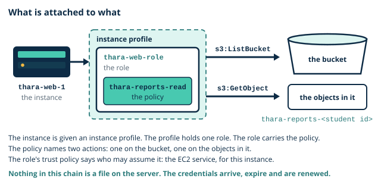

# Lab 5: Least privilege, keys, trails, group access

**Day 5, afternoon session. Duration 3 hours. Builds component 10 (Identity, keys and audit) and adds to component 3 (Laboratory reports bucket) of the Thara Hospitals architecture.**

| | |
|---|---|
| Learning outcomes | LO5, LO8 |
| Sub-outcomes | S5.3, S8.1, S8.2 |
| Prerequisites | From Day 4: `thara-bastion` and `thara-web-1`, both stopped, the S3 gateway endpoint on `thara-private-rt`, and the inactive Day 2 access key. From Day 2: the bucket `thara-reports-<student id>` and the snapshot of the data volume. From this morning: your pair's threat table. On your computer: `thara-key.pem`. Your group's host account is nominated |
| Estimated credit consumption | USD 0.80 |
| Evidence pack | Pack 5, due before the next teaching day |

## 0. Before you start

1. Region check: the console shows **Asia Pacific (Mumbai) ap-south-1**. If not, change it now.
2. You are signed in as your **admin IAM user**, not root.
3. Tags for everything today: `Module=CC`, `Day=5`, `Owner=<student id>`.
4. Open your cost ledger. Write today's date and the segment names below with a blank cost column.

Console labels below are as they appeared at the time of writing. AWS renames buttons from time to time; if a label differs, look for the same idea nearby and tell your lecturer.

You need the same terminal as on Day 4, opened in the folder that holds `thara-key.pem`.

### The ideas behind today's lab

#### Fixing Day 2

On Day 2 you typed a long-lived access key into `thara-web-1`, on purpose, and the lab sheet called it the insecure method. On Day 4 you typed it in again. Today it goes for good, and two rules govern how.

- **The long-lived key on `thara-web-1` is removed today and replaced with an instance [role](../../glossary.md#role).** The key carried the whole power of your admin user and sat in a text file on a server. The role carries two permissions on one bucket, and the server never stores it: the instance is handed short-lived credentials that expire by themselves and are renewed for it.
- **The role's policy is written first, tested in the simulator, then attached. Never the other way round.** A policy that has never been tested and is attached to a live server gets its first test from the patients. So segment 1 goes in a fixed order: write, simulate, create the role, attach it. Only then does segment 2 take the key away.



Three things are worth knowing before you start.

**The role does not replace the key by being attached.** The command line on `thara-web-1` looks for credentials in a fixed order, and a credentials file comes before an instance role. While the file from Day 4 is still there, the command line uses it, finds a key that is switched off, and fails. Step 7 shows you this before step 8 fixes it.

**Removing the file does not remove the key.** The file is one copy. The key itself lives in IAM, and so does every other copy that anyone ever made of it. A key is finished only when it is deleted in IAM.

**`thara-web-1` can reach S3 and nothing else.** It has no NAT gateway today. Its one path out of the VPC is the gateway endpoint from Day 4, which leads to S3. So every proof you run on the server is an S3 command, and a command for any other AWS service would wait and time out.

Two things today carry no name, only the three tags: the encrypted volume and the Access Analyzer analyzer, which takes the name the console offers. Every other name comes from Thara's naming table or is given in the step that uses it.

> **Quick check.** In step 7 the role is attached to `thara-web-1`, the Day 4 credentials file is still on the server, and the bucket listing fails. Why?
>
> - [ ] A new role needs some hours before an instance can use it
> - [ ] The gateway endpoint refuses requests that are signed by a role
> - [x] The command line reads the file first, and that key is inactive
>
> **Why:** The command line looks for credentials in a fixed order, and a credentials file comes before an instance role. It finds the old key, signs with it, and is refused. Nothing is wrong with the role or the endpoint.

> **Quick check.** Suppose someone copied the credentials file from `thara-web-1` last week. Today you delete the file from the server, and you leave the key itself in IAM. What can the copy do?
>
> - [x] Whatever the key allows, once the key is active again
> - [ ] Nothing: removing the file on the server cancelled the key
> - [ ] Only requests that are sent from inside `thara-vpc`
>
> **Why:** The file is a copy and the key lives in IAM. An inactive key can be switched on again by anyone who can administer the account, and then every copy works, from anywhere. Only deleting the key in IAM ends it.

> **Common mistake.** "A role is a user." It is not. A user has a password or a key of its own and signs in. A role has neither: it is assumed, by whoever its trust policy names, and each time it issues temporary credentials that expire.

> **Common mistake.** "Deleting a key from the instance revokes it." It does not. The file on the server is a copy. The key works from anywhere until it is deleted in IAM, which is what step 8 does.

## 1. Objective

At the end of this lab `thara-web-1` reads the laboratory reports bucket through a role and holds no stored credential, the Day 2 access key no longer exists, a volume is encrypted with a [customer-managed key](../../glossary.md#customer-managed-key), a [trail](../../glossary.md#trail) records every administrative action to an audit bucket, and your capstone group's members can sign in to the host account with a policy for each tier: component 10, with component 3 read through the new role. The role is used by the Day 7 launch template and the key by the Day 6 database; the lab serves Thara's requirements that every administrative action is attributable to a named person and that records and reports are encrypted at rest.

## 2. Timed segments

| Segment | Minutes | Cost note |
|---|---|---|
| Policy, simulator, role, instance profile | 45 | nil |
| Remove the key; prove access still works | 15 | nil |
| KMS key and encrypted volume | 30 | customer-managed key about USD 1 per month, prorated by the hour |
| CloudTrail trail | 20 | first trail free; audit bucket negligible |
| GuardDuty and Access Analyzer | 15 | 30-day trial |
| Group member access in the host account | 25 | nil |
| Optional credit harvest; ledger; evidence | 15 | nil |

Segments containing a NAT gateway, a load balancer or a database are created, used and deleted inside the segment. Do not carry them across the break. Today has none of the three. What bills today is quieter: the two Thara instances by the hour while they run, and the key from segment 3, which costs about USD 0.03 a day for as long as it exists. The key is kept on purpose, because Day 6 needs it. Prices are for ap-south-1 at the time of writing.

## 3. Steps

Each step states what to do and what you should see. If you do not see it, stop and diagnose before moving on.

*Segment 1: Policy, simulator, role, instance profile*

1. **Check where and who you are.** Confirm the region selector shows **Asia Pacific (Mumbai) ap-south-1** and the top bar shows `admin-<student id>`. *Expected:* both are correct.

2. **Start the two instances and reopen the door.** In EC2, **Instances**, select `thara-bastion` and `thara-web-1`, then **Instance state**, **Start instance**. The bastion comes back with a **new** public address, and your own address may have changed since Day 4. So open **Security groups**, `thara-bastion-sg`, **Edit inbound rules**, set the source of the SSH rule to **My IP** again, and save. Note the bastion's new **Public IPv4 address**, connect to it, and hop to `thara-web-1` with the method you used on Day 3 and Day 4:

   ```bash
   ssh-add thara-key.pem
   ssh -A ec2-user@<bastion public IPv4 address>
   ssh ec2-user@<web private address>    # typed on the bastion
   ```

   *Expected:* a prompt on `thara-web-1` of the form `[ec2-user@ip-10-0-11-... ~]$`. If the first connection waits and times out, check the SSH source of `thara-bastion-sg` before anything else.

3. **Write the policy.** Decide first what the web tier needs. It lists the reports bucket and it downloads reports. It never uploads, never deletes and never touches another bucket. That is two actions on one bucket. Open IAM, **Policies**, **Create policy**, and choose the **JSON** editor. The editor opens with a `Version` line and an empty `Statement` list. Leave the `Version` line exactly as it is, and make the `Statement` list read:

   ```json
   "Statement": [
     {
       "Sid": "ListTheReportsBucket",
       "Effect": "Allow",
       "Action": "s3:ListBucket",
       "Resource": "arn:aws:s3:::thara-reports-<student id>"
     },
     {
       "Sid": "ReadTheReports",
       "Effect": "Allow",
       "Action": "s3:GetObject",
       "Resource": "arn:aws:s3:::thara-reports-<student id>/*"
     }
   ]
   ```

   Choose **Next**. Policy name `thara-reports-read`, description `Web tier: list and read the laboratory reports bucket`, the three tags. Choose **Create policy**. *Expected:* `thara-reports-read` is listed with the type **Customer managed**. Look at the two `Resource` lines: listing is an action on the **bucket**, and reading is an action on the **objects** in it, which is what `/*` means. A statement that puts `s3:GetObject` on the bucket's own name matches nothing. Copy the finished JSON into your evidence pack.

4. **Test it before it is attached to anything.** In the IAM navigation pane choose **Policy simulator**. Choose the custom mode, in which you paste a policy that is attached to nothing, and paste the whole of `thara-reports-read`. Then run three simulations, each with the action and the resource shown:

   | Action | Resource | You expect |
   |---|---|---|
   | `s3:GetObject` | `arn:aws:s3:::thara-reports-<student id>/reports-index.txt` | allowed |
   | `s3:PutObject` | `arn:aws:s3:::thara-reports-<student id>/reports-index.txt` | implicitly denied |
   | `s3:ListBucket` | `arn:aws:s3:::thara-audit-<student id>` | implicitly denied |

   *Expected:* the three results in the table. Write your prediction for each before you run it. Nothing in the policy says "deny": the second and third are refused because no statement allows them, which is what an implicit deny is. Take one screenshot that shows all three results.

5. **Create the role.** In IAM choose **Roles**, **Create role**. Trusted entity type **AWS service**; service or use case **EC2**; choose **Next**. Tick `thara-reports-read` and nothing else; **Next**. Role name `thara-web-role`, the three tags, **Create role**. Open the role and read its **Trust relationships** tab. *Expected:* the role lists one permissions policy, `thara-reports-read`. Its trust policy names the principal `ec2.amazonaws.com` and the action `sts:AssumeRole`: this is the statement that says who may assume the role, and the answer is the EC2 service, on behalf of an instance. Now look down the list of roles for the one the console created for your flow log on Day 3. It is the same kind of thing: a role that a service assumes, so that nobody has to give that service a key.

6. **Give the role to the server.** In EC2, **Instances**, select `thara-web-1`, then **Actions**, **Security**, **Modify IAM role**. Choose `thara-web-role` and **Update IAM role**. *Expected:* the instance's **Security** tab shows **IAM Role** `thara-web-role`. What you chose from that list was an [instance profile](../../glossary.md#instance-profile): the IAM console made one with the role's name when you created the role, and it is the container that hands a role to an instance.

*Segment 2: Remove the key; prove access still works*

7. **Find out which credentials the server is using.** On `thara-web-1`:

   ```bash
   aws s3 ls s3://thara-reports-<student id>
   aws configure list
   ```

   *Expected:* the listing **fails**, with an error that names the access key. The second command prints a small table: in the `access_key` row, the **Type** column reads `shared-credentials-file`. The role is attached and is not being used, because the command line reads the credentials file first, and that file holds a key that is switched off. Keep this output. If the listing works at once and the Type column reads `iam-role`, your server has no credentials file; note that, and carry on from step 8.

8. **Remove the file, then delete the key.** On `thara-web-1`:

   ```bash
   rm ~/.aws/credentials
   aws configure list
   ```

   Then open IAM, **Users**, `admin-<student id>`, **Security credentials**, **Access keys**. For the Day 2 key choose **Actions**, **Delete**, type the key id to confirm, and delete it. Delete the key's `.csv` file from your computer as well. *Expected:* in the table the Type column of `access_key` now reads `iam-role`, and the `region` row still reads `ap-south-1`, because the region is kept in a different file, `~/.aws/config`, which you leave alone. In IAM your admin user has **no access keys**. Write the row in your ledger: "Day 2 access key deleted".

9. **Prove the role, and prove its limits.** On `thara-web-1`:

   ```bash
   aws s3 ls s3://thara-reports-<student id>
   echo "upload test" > /tmp/upload-test.txt
   aws s3 cp /tmp/upload-test.txt s3://thara-reports-<student id>/
   aws s3 ls
   TOKEN=$(curl -s -X PUT http://169.254.169.254/latest/api/token \
     -H "X-aws-ec2-metadata-token-ttl-seconds: 60")
   curl -s -H "X-aws-ec2-metadata-token: $TOKEN" \
     http://169.254.169.254/latest/meta-data/iam/security-credentials/thara-web-role \
     | grep Expiration
   ```

   *Expected:* the first command lists `reports-index.txt`. The upload fails with `AccessDenied`: the message names a user of the form `assumed-role/thara-web-role/i-...` and says that no identity-based policy allows the `s3:PutObject` action. The third command is refused in the same way: the role may list one bucket, and not even the names of the others. The last command prints one line, `"Expiration"`, with a time a few hours ahead: the credentials the server is using right now will stop working by themselves, and the instance will have been handed new ones before then. Nobody typed a secret into this server, and there is no file to steal.

*Segment 3: KMS key and encrypted volume*

10. **Create a key that you own.** Open the Key Management Service (KMS) console and check the region is Mumbai. Choose **Customer managed keys**, **Create key**. Key type **Symmetric**, key usage **Encrypt and decrypt**; **Next**. Alias `thara-records`; add the three tags; **Next**. Key administrators: tick `admin-<student id>`; **Next**. Key users: tick `admin-<student id>` and nothing else; **Next**. Read the key policy on the review page, then choose **Finish**. Write the time in your ledger. *Expected:* the key is listed as **Enabled** with the alias `thara-records`; elsewhere in AWS it is written `alias/thara-records`. The review page showed you a **[key policy](../../glossary.md#key-policy)**: a policy attached to the key itself, saying who may manage it and who may use it. Notice who is not in it: `thara-web-role`. The role may read the reports bucket, and it may not use this key. Those are two separate questions with two separate answers.

11. **Encrypt a volume with it, and read the old data.** In EC2 choose **Snapshots**, select the snapshot with the description `Day 2 data volume`, then **Actions**, **Create volume from snapshot**. Volume type **gp3**, size 8 GiB, Availability Zone `ap-south-1a`, tick **Encrypt this volume**, and for **KMS key** choose `thara-records`. Add the three tags and create it. Open **Volumes**; when the new volume is **Available**, select it, **Actions**, **Attach volume**, instance `thara-web-1`, device name `/dev/sdf`. On `thara-web-1`:

    ```bash
    lsblk
    sudo mkdir -p /data
    sudo mount /dev/nvme1n1 /data
    cat /data/reports-index.txt
    ```

    *Expected:* `lsblk` lists an 8G disk, `nvme1n1`; the last command prints `Thara Hospitals laboratory reports index`, the line you wrote on Day 2. In the console the volume's details show **Encryption: Encrypted** and the **KMS key alias** `thara-records`. The snapshot was not encrypted and the volume made from it is: every block is now stored encrypted, and nothing on the server changed, because encryption and decryption happen underneath the operating system. One more observation, with no change to make: open S3, `thara-reports-<student id>`, **Properties**, and find **Default encryption**. It is already on, with keys that S3 manages. Buckets are encrypted without being asked; volumes are encrypted when you ask.

*Segment 4: CloudTrail trail*

12. **Create the trail and its bucket.** Open the CloudTrail console and check the region is Mumbai. Choose **Trails**, **Create trail**. Trail name `thara-trail`. Storage location **Create new S3 bucket**, and replace the bucket name that is offered with `thara-audit-<student id>`. Under **Log file SSE-KMS encryption**, **clear** the **Enabled** box: left ticked, it creates a second key, with a charge of its own, that nothing in this module uses. Leave CloudWatch Logs off. Add the three tags; **Next**. Keep **Management events** ticked with **Read** and **Write**; **Next**; **Create trail**. Then open S3, `thara-audit-<student id>`: on **Permissions** confirm **Block all public access: On**, and on **Properties** add the three tags. *Expected:* the trail's status is **Logging** and it is a multi-region trail. The audit bucket is private. The trail created the bucket so that it could also write the bucket policy that lets CloudTrail, and nothing else, deliver log files into it.

13. **Make a change, then find yourself.** In EC2 open **Security groups**, `thara-web-sg`, **Edit inbound rules**, **Add rule**: type **HTTPS**, source **Custom**, `thara-bastion-sg`. Save, and note the time. Then **Edit inbound rules** again, delete that one rule, and save. Copy the group's id, which begins `sg-`. Now do step 14, and come back here afterwards: an event takes a few minutes to appear. In CloudTrail choose **Event history**, set the filter to **Resource name** and paste the group's id. *Expected:* two events from the event source `ec2.amazonaws.com`, one for the rule you added and one for the rule you removed, with names that begin `AuthorizeSecurityGroupIngress` and `RevokeSecurityGroupIngress`. Open the first. It shows the **User name** `admin-<student id>`, the **Event time**, and the **Source IP address**, which is your own public address. Take a screenshot of that event. `thara-web-sg` is back to its two rules from Day 3.

*Segment 5: GuardDuty and Access Analyzer*

14. **Switch on two watchers.** Open the GuardDuty console, check the region, choose **Get started** and **Enable GuardDuty**. *Expected:* a summary page with no [findings](../../glossary.md#finding) yet, and a count of the trial days remaining. Write the trial's last day in your ledger: after it, GuardDuty bills for what it analyses. If the console refuses because of your account's plan, copy the message into your evidence pack and carry on; your lecturer shows the findings page. Then open IAM, and under **Access analyzer** choose **Analyzer settings**, **Create analyzer**. Analysis **Resource analysis - External access**; keep the name the page offers; zone of trust **Current account**; the three tags; **Create analyzer**. *Expected:* the analyzer's status becomes **Active**. Its list of findings may take up to half an hour to settle, and it is likely to stay empty: nothing you have built can be reached from outside your account. Record what each service shows. An empty list is a result, and it is the one you want.

*Segment 6: Group member access in the host account*

This segment is done once for each capstone group, **in the host account only**. The host works at the console; the other members sit beside the host until their own sign-in test.

15. **Create the group and the members' users.** In IAM choose **User groups**, **Create group**, name `thara-capstone`, with no policy attached. Then **Users**, **Create user**, once for each member other than the host. The user name is the member's tier and student id: `network-<student id>`, `security-<student id>` or `data-<student id>`. Tick **Provide user access to the AWS Management Console**, choose **I want to create an IAM user**, an autogenerated password, and leave **Users must create a new password at next sign-in** ticked. Add the user to `thara-capstone`, add the three tags, and create it. Give each member their password in person, and the account's sign-in address from the IAM **Dashboard**. *Expected:* `thara-capstone` lists one user for each member other than the host. So far a member can sign in and can do nothing, which is the right place to start.

16. **Complete, test and attach one policy for each tier.** Create three customer managed policies as you did in step 3, named `thara-capstone-network`, `thara-capstone-security` and `thara-capstone-data`, each with the three tags. The `Statement` list of each is given below with one or two gaps, marked `____`. The group agrees what goes in each gap before the host types it.

    `thara-capstone-network`: read the network, and change only what carries the module's tag.

    ```json
    "Statement": [
      {
        "Sid": "ReadTheNetwork",
        "Effect": "Allow",
        "Action": "ec2:Describe*",
        "Resource": "*"
      },
      {
        "Sid": "ChangeOnlyWhatIsTagged",
        "Effect": "Allow",
        "Action": [
          "ec2:CreateRoute", "ec2:DeleteRoute", "ec2:ReplaceRoute",
          "ec2:AuthorizeSecurityGroupIngress",
          "ec2:RevokeSecurityGroupIngress",
          "ec2:StartInstances", "ec2:StopInstances"
        ],
        "Resource": "*",
        "Condition": {
          "StringEquals": { "aws:ResourceTag/Module": "____" }
        }
      }
    ]
    ```

    `thara-capstone-security`: read identities, work with keys and trails, and never be able to destroy a key or silence the audit.

    ```json
    "Statement": [
      {
        "Sid": "ReadIdentities",
        "Effect": "Allow",
        "Action": ["iam:Get*", "iam:List*"],
        "Resource": "*"
      },
      {
        "Sid": "KeysAndTrails",
        "Effect": "Allow",
        "Action": ["kms:*", "cloudtrail:*"],
        "Resource": "*"
      },
      {
        "Sid": "NeverDestroyOrSilence",
        "Effect": "____",
        "Action": [
          "kms:ScheduleKeyDeletion", "kms:DisableKey",
          "cloudtrail:StopLogging", "cloudtrail:DeleteTrail"
        ],
        "Resource": "*"
      }
    ]
    ```

    `thara-capstone-data`: work with buckets, databases and backups, and never touch the audit bucket.

    ```json
    "Statement": [
      {
        "Sid": "BucketsDatabasesBackups",
        "Effect": "Allow",
        "Action": ["s3:*", "rds:*", "backup:*"],
        "Resource": "*"
      },
      {
        "Sid": "HandsOffTheAuditBucket",
        "Effect": "Deny",
        "Action": "s3:*",
        "Resource": [
          "____",
          "____"
        ]
      }
    ]
    ```

    Attach each policy to its member's user: open the user, **Add permissions**, **Attach policies directly**. The host's own tier has no user; test that policy in the simulator's custom mode, as in step 4. For each of the other two, open **Policy simulator**, choose the mode that tests an existing user, role or group, select the member's user, and run the two simulations in its row:

    | Member | Expect allowed | Expect refused |
    |---|---|---|
    | network | `ec2:DescribeVpcs` | `iam:CreateUser`, implicitly denied |
    | security | `iam:ListUsers` | `kms:ScheduleKeyDeletion`, explicitly denied |
    | data | `s3:GetObject` on an object in `thara-reports-<student id>` | `s3:DeleteObject` on an object in `thara-audit-<student id>`, explicitly denied |

    Then each member signs in to the host account, in a private browser window so that their own account stays signed in elsewhere, sets a new password, and tries one thing their tier allows and one it does not: the network member opens **Your VPCs** and then S3; the security member opens IAM **Users** and then EC2 **Instances**; the data member opens S3 and then IAM **Users**. Last, the host opens each policy's **JSON** view and saves the three documents as files for the capstone evidence. *Expected:* every simulation matches its row; every member sees one page that works and one that says they are not authorised; and the group holds three JSON files. Record each sign-in test: who, which page worked, which was refused. These policies are a first version. As the capstone build goes on, each refusal a member meets is a question for the group: is this something that tier should be able to do? Change the policy on purpose, never by attaching a wider one.

*Segment 7: Optional credit harvest; ledger; evidence*

17. **Optional, 15 minutes, not examined: bank the remaining credits.** The **Explore AWS** widget on Console Home lists activities that each add credits to a Free Plan account. Budgets and EC2 you have done, and the database activity comes with Day 6. The two that remain are "Create a web app using Lambda" and "Use a foundational model in the Amazon Bedrock playground". Follow the widget's own instructions for each, delete whatever it had you create, and write a ledger row for each. Neither service is part of this module. *Expected:* the widget shows the activities as completed; the credits may take some days to appear.

Then write the ledger rows (section 7), do sections 4 and 5, tear down (section 6), and collect the evidence (section 8).

## 4. Prove it

Paste the output of each into your evidence pack.

- On `thara-web-1`, with no credentials file present (`ls ~/.aws` shows `config` only): `aws s3 ls s3://thara-reports-<student id>` succeeds, and `aws s3 cp /tmp/upload-test.txt s3://thara-reports-<student id>/` is denied.
- The encrypted volume's details show the KMS key alias `thara-records`.
- The CloudTrail event for the change to `thara-web-sg`, showing your user name.
- For the group: each member's sign-in test, with one action allowed and one refused.

## 5. Break it

**Fault:** the bucket listing stops working, although the role is attached and its policy has not changed.

1. In IAM open **Roles**, `thara-web-role`, **Add permissions**, **Create inline policy**, and choose the **JSON** editor. Make the `Statement` list read:

   ```json
   "Statement": [
     {
       "Sid": "DenyEverythingInS3",
       "Effect": "Deny",
       "Action": "s3:*",
       "Resource": "*"
     }
   ]
   ```

   Name it `thara-deny-test` and create it.
2. On `thara-web-1` run `aws s3 ls s3://thara-reports-<student id>`. If it still works, wait a few seconds and repeat. **Symptom:** `AccessDenied`.
3. **Locate it** with what you already know. Read the whole message: it ends "with an explicit deny in an identity-based policy". The allow in `thara-reports-read` is still there, and it has lost. Confirm it in the **Policy simulator**: choose the mode that tests an existing role, select `thara-web-role`, and simulate `s3:ListBucket` on `arn:aws:s3:::thara-reports-<student id>`. The result is explicitly denied, and the simulator names the statement that did it.
4. **Fix:** on the role's **Permissions** tab, remove `thara-deny-test`. Repeat the listing until it works.

Record the fault, the symptom, the evidence that located it and the fix in the table in section 4 of your evidence pack. Say in one sentence why adding a second allow would not have fixed it.

## 6. Teardown

Do these in order. Check your ledger rows are written first.

1. **Remove the encrypted volume.** On `thara-web-1` run `sudo umount /data`. In EC2, **Volumes**, select the encrypted volume, **Actions**, **Detach volume**; when it is **Available**, **Actions**, **Delete volume**. *Expected:* the volume is gone and the snapshot `Day 2 data volume` is still listed.
2. **Confirm that the break-it left nothing behind.** `thara-web-role` lists one policy, `thara-reports-read`, and no inline policy.
3. **Confirm that `thara-web-sg` has its two rules** from Day 3 and no HTTPS rule.
4. **If you ever copied `thara-key.pem` to the bastion**, check that it is gone: on the bastion, `ls ~` should not list it. If it does, `rm ~/thara-key.pem`.
5. **If you did step 17**, delete anything the two activities created.
6. **Stop `thara-bastion` and `thara-web-1`**: **Instance state**, **Stop instance**. Do not terminate them. *Expected:* both show **Stopped**.

What you keep, and why:

| Kept | Why |
|---|---|
| `thara-web-role` and `thara-reports-read` | The server uses them from now on. The Day 7 launch template gives the same role to every web server |
| `alias/thara-records` | Day 6 encrypts the patient records database with it. It costs about USD 0.03 a day |
| `thara-trail` and `thara-audit-<student id>` | The record of who did what. Kept until marking is complete |
| GuardDuty and the Access Analyzer analyzer | Day 7 uses their findings. Watch the trial's last day in your ledger |
| The group `thara-capstone`, its users and the three tier policies, in the host account | The capstone is built with them |
| The snapshot `Day 2 data volume` | Day 6 restores from it |
| `thara-bastion` and `thara-web-1`, stopped | Day 6 starts them again |

The Day 2 access key is not on this list. It no longer exists.

## 7. Cost line

Estimate for today: **USD 0.80**. The afternoon itself comes to about USD 0.10: two `t3.micro` instances for three hours, the bastion's public IPv4 address, and an hour of the encrypted volume. The key is the new kind of line: about USD 0.03 a day for as long as it exists, so about USD 0.23 for the week to Day 6. A week of the two stopped root volumes adds about USD 0.35. The trail's first copy of management events is free, the audit bucket holds a few kilobytes, and GuardDuty is inside its trial.

Add one ledger row for each of: `thara-bastion` and `thara-web-1` (start and stop times), the KMS key (created, with the note "kept; about USD 1 a month"), the encrypted volume (created and deleted), the trail and the audit bucket (cost 0.00), GuardDuty (enabled, with the trial's last day), the Access Analyzer analyzer (cost 0.00), and the Day 2 access key (deleted). Write the day's total against the estimate. If it is higher than the estimate, write why in one line.

## 8. Evidence required

1. The JSON of `thara-reports-read`, and the screenshot of its three simulator results (steps 3 and 4).
2. The CloudTrail event for the change to `thara-web-sg`, with user name, time and source address (step 13).
3. A one-page security review memo: the findings from this morning's threat walk, and which of today's steps remedied each one. Say what is still open.
4. For the group: the three tier policies as JSON, and the record of each member's sign-in test (step 16).
5. The outputs listed in section 4, and your saved output from step 7.
6. Your break-it row from section 5, with your sentence on why a second allow would not have fixed it.

Check every screenshot before you submit it: no secret access key, no password, and the middle digits of your account id masked.

## 9. Thara connection

This lab answers the Data Protection Officer, who asks three things: who can read patient data, what protects it, and how the hospital would know. Until this afternoon the honest answer to the first was "anyone holding that access key". Now the web tier reads the reports through a role that can list and read one bucket and nothing else, and there is no stored secret on the server to copy. Every administrative action must be attributable to a named person: the trail records each change with a user name, a time and an address, and you have found your own. Records and reports must be encrypted at rest: the reports bucket already was, and the key that Day 6 gives to the patient records database now exists and is yours. The Head of IT would ask whether the group's members can break each other's work, and the three tier policies are the answer, tested before anyone signed in. The CFO would ask what all this costs each month: one key, at about USD 1.
