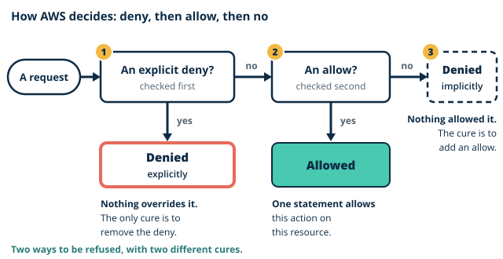
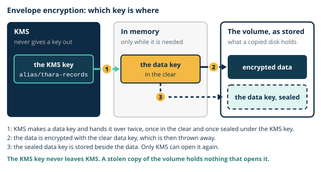

# Day 5 notes: Identity, encryption, detection

These notes go with the morning slides. They build the ideas you need before this afternoon's lab, where you build component 10 (identity, keys and audit) of the Thara architecture and change how the web tier reaches component 3, the laboratory reports bucket.

## Where you are starting

So far you have built components 1 to 9. The network is finished: `thara-vpc` has its public and private subnets, `thara-bastion` is the one door for administrators, `thara-web-1` sits in a private subnet, and on Day 4 it gained a private path to the reports bucket through the S3 gateway endpoint.

Three things were left unpaid on the way here. On Day 2 you typed an access key with the full power of your account into a text file on the web server, and on Day 4 you typed it in again; it is switched off, and it still exists. On Day 3 the console created a "service role" for your flow log, and the lab sheet said only that Day 5 explains roles. And from the first day the Data Protection Officer has been asking three questions that the network cannot answer: who can read patient data, what protects it, and how the hospital would know if someone did.

Today answers them in that order. Who is asking, and what decides the answer, is identity. What protects the data when the storage itself is copied is encryption. How anyone would know is detection. The afternoon builds one piece of each.

## 1. Identity is the perimeter

On Days 3 and 4 the perimeter was a network: subnets, routes and firewalls decided what could reach what. But every AWS service is also reached through its API, from anywhere on the internet, and a request that carries valid credentials never touches your route tables. For the API, the perimeter is identity.

**Principals.** Every request to AWS is made by a [principal](../../glossary.md#principal): the identity that is asking. A principal is an IAM user, a role, or an AWS service acting for you. The root user is a principal too, and the only one that no policy can restrict. Every question about access begins with "who is asking?".

**Two kinds of policy.** A policy is a JSON document that says what is allowed or denied. It comes in two kinds, the [identity-based policy](../../glossary.md#identity-based-policy) and the resource-based policy, and the difference is what each is attached to.

| | Identity-based policy | Resource-based policy |
|---|---|---|
| Attached to | A user, a group or a role | A resource: a bucket, a key, a role's trust |
| Answers | What may this identity do? | Who may do what to this resource? |
| Names a principal | No: the principal is whoever it is attached to | Yes: it must say who it is talking about |
| You meet it | This afternoon: the web tier's policy | This afternoon: a key policy and a trust policy. Day 6: a bucket policy |

**The anatomy of a statement.** A policy holds one or more statements. This is one of the two that you write this afternoon:

```json
{
  "Sid": "ReadTheReports",
  "Effect": "Allow",
  "Action": "s3:GetObject",
  "Resource": "arn:aws:s3:::thara-reports-<student id>/*"
}
```

- `Effect` is `Allow` or `Deny`. There is no third value.
- `Action` names what may be done, as a service and an operation. A star is a wildcard: `s3:*` is every S3 action.
- `Resource` names what it may be done to, as an ARN, the full name of a resource. Here it is every object in one bucket.
- `Sid` is a label for people. A statement may also carry a `Condition`, which narrows it further, and a resource-based policy adds a `Principal`.
- Around the statements sits a `Version` line. It is always the same fixed text, and the console writes it for you.

**How AWS decides.** For every request, AWS gathers every statement that applies and decides in a fixed order.

1. Is there an **[explicit deny](../../glossary.md#explicit-deny)**, a statement with the effect `Deny` that matches? Then the answer is no, and nothing can override it.
2. If not, is there an **allow** that matches? Then the answer is yes.
3. If neither, the answer is no. This is the **implicit deny**: everything is refused until something allows it.



So there are two ways to be refused and they are not the same. An implicit deny is cured by adding an allow. An explicit deny is not cured by anything except removing it. Add and remove statements and watch the verdict change in [policy-evaluator](artefacts/policy-evaluator.html).

> **Quick check.** `thara-web-role` has a policy that allows `s3:GetObject` on the reports bucket. Someone attaches a second policy that denies `s3:*`. The web tier asks for a report. What happens?
>
> - [ ] It is allowed, because the allow names the exact action
> - [x] It is denied, because an explicit deny always wins
> - [ ] It depends on which policy was attached most recently
>
> **Why:** A matching deny is looked for first, and nothing overrides it. How specific the allow is, and the order in which policies were attached, play no part. The only cure is to remove the deny.

The **policy simulator** in the IAM console runs this check for you without touching anything real. You give it a policy, an action and a resource, and it answers allowed, implicitly denied or explicitly denied, and names the statement that decided. This afternoon you test a policy there before it is attached to anything.

**[Least privilege](../../glossary.md#least-privilege) is a method, not a slogan.** Everyone agrees that an identity should have only the permissions it needs. The method is what makes it happen.

1. Start from the workload, not from the service. The web tier lists the reports bucket and downloads reports.
2. Write down the actions that work needs: `s3:ListBucket` and `s3:GetObject`. Not `s3:*`.
3. Write down the resources: one bucket, and the objects in it. Not `*`.
4. Write the policy, and test it in the simulator against what it should allow and what it should refuse.
5. Attach it. Widen it later only when a refusal shows that the work needs more.

The opposite method is to grant everything and plan to tighten it later. Later does not come, and the wide policy is the one an attacker inherits.

**Roles, instance profiles and temporary credentials.** A user has credentials of its own: a password, or an access key that works until someone deletes it. A **[role](../../glossary.md#role)** has none. A role is an identity that is assumed: its trust policy names who may take it on, and whoever does is issued **[temporary credentials](../../glossary.md#temporary-credentials)**, a key, a secret and a token that expire by themselves within hours. For an EC2 instance, the role is handed over through an **[instance profile](../../glossary.md#instance-profile)**, and the instance collects fresh credentials before the old ones expire. Nothing is typed in and nothing is stored on a disk.

You have already used one. The service role that the console created for your flow log on Day 3 is a role that the flow logs service assumes, so that it can write to your log group without anyone giving it a key. And the sixty-second key that EC2 Instance Connect pushed on Day 2 was the same idea in a smaller form: a credential that expires before it can be lost.

This is the cure for long-lived keys. The Day 2 key had three faults: it carried every permission of your admin user, it never expired, and it sat in a file. A role fixes all three. Compare the two paths, and steal the credential in each, in [role-vs-key](artefacts/role-vs-key.html).

> **Quick check.** The contractor needs to read Thara's logs for two days. Which way of giving him access needs nobody to remember anything on the third day?
>
> - [x] A role he assumes, whose credentials expire by themselves
> - [ ] An IAM user with an access key, to be deleted on day three
> - [ ] The admin user's password, changed again when he leaves
>
> **Why:** A role issues temporary credentials, so nothing long-lived exists to be forgotten. A key that is "to be deleted" works until someone deletes it, and a shared admin password also means the audit trail cannot say who did what.

**MFA and key hygiene.** The rest is discipline, and it is short.

- MFA on every identity that a person uses, as on Day 1. A stolen password is then not enough.
- No access keys on the root user, ever.
- No long-lived key where a role will do. Where a key must exist, it is never put in a file on a server, in a screenshot or in a repository, and it is deleted when its job ends. A key that is only deactivated can be switched on again.
- One person, one identity. A shared login means that the audit trail names nobody.
- The same goes for the SSH key. On Day 3 you reached `thara-web-1` either by forwarding your agent through the bastion or by copying `thara-key.pem` onto it. Neither is ideal: a forwarded agent can be used by anyone with control of the bastion while you are connected, and a copied key sits on the one server that faces the internet. Both were for teaching, and the copy was removed.

**Organizations.** One account is enough for a pilot. A real organisation runs many: one for production, one for testing, one for audit logs. AWS Organizations groups accounts so that there is **one bill** and **one policy boundary**: a policy set at the top that no account beneath it can exceed, whatever its own administrators allow. You do not build this. You should know that it exists, and that it is how a hospital group would keep its audit logs out of reach of the people being audited.

> **You already know this.** RBAC on a firewall manager; the enable password nobody should share. A policy attached to a role is role-based access control: the engineer gets the permissions of the job, not of the person. The long-lived access key is the shared enable password: it works for whoever holds it, it never changes, and the log cannot say who used it.

> **Thara.** The Day 2 key on the web server; the contractor who needs two days of log access; the DPO's "who". The key is replaced by a role this afternoon. The contractor is the same problem with a person in it: he needs to read the logs for two days and nothing else, so he gets a role whose credentials expire, not a key that somebody must remember to delete. And the DPO's question, who can read patient data, now has an answer you can read out of a policy.

> **Common mistake.** "An explicit allow wins." It does not. An explicit deny always wins. If one policy allows an action and another denies it, the answer is no, however specific the allow is and whichever was attached last.

## 2. Encrypting what the hospital holds

Access control decides who may ask. Encryption protects the data when the question is never asked: when a disk, a snapshot or a backup is copied by someone who goes around the API altogether.

**At rest and in transit.** Data is encrypted **at rest** when it is stored encrypted, on a volume, in a bucket or in a database. It is encrypted **in transit** when it is protected on the wire, which on the web means TLS. Thara needs both. This afternoon is about data at rest. In transit arrives on Day 7, where TLS is terminated at the load balancer: the patient's browser speaks HTTPS to the load balancer, which is where the certificate lives.

**KMS and customer-managed keys.** The AWS Key Management Service (KMS) creates and holds encryption keys, and it never hands them out. You cannot download a KMS key. You can only ask KMS to use it for you, and every such request is checked against policy and recorded. Keys come in two kinds. An AWS managed key is created and looked after by AWS for one service; you can use it and cannot change it. A **[customer-managed key](../../glossary.md#customer-managed-key)** is one that you create: you write its policy, you can disable it, and you can schedule it for deletion. It costs about USD 1 a month at the time of writing. Thara's is `alias/thara-records`.

**[Envelope encryption](../../glossary.md#envelope-encryption).** KMS does not encrypt your disk. A volume of many gigabytes is not sent to KMS and back. Instead there are two keys, one inside the other.

1. The service asks KMS for a **data key**. KMS returns it twice: once in the clear, and once encrypted under your KMS key.
2. The service encrypts the data with the clear data key, then throws that copy away.
3. It stores the **encrypted data key** beside the encrypted data. That is the envelope: the key travels with the data, sealed.
4. To read the data, the service sends the sealed data key to KMS. If policy allows, KMS opens it and returns the clear data key, which is held in memory only while it is needed.



Three things follow. The KMS key itself never leaves KMS. Stolen storage is useless, because it holds only encrypted data and a sealed key. And disabling one KMS key makes everything encrypted under it unreadable at once. Step through both directions in [envelope-encryption](artefacts/envelope-encryption.html).

**What is encrypted without being asked.** The two storage services you have used behave differently.

- **S3** encrypts every new object by default, with keys that S3 manages. You did nothing on Day 2, and `thara-reports-<student id>` has been encrypted since.
- **EBS** encrypts a volume when you ask for it at creation, or when an account has been set to encrypt every new volume. Your Day 2 data volume and its snapshot were not encrypted. A volume created from an unencrypted snapshot can be encrypted as it is created, which is what the lab does. A snapshot of an encrypted volume is always encrypted.

**Key policy versus IAM policy.** Every KMS key has a **[key policy](../../glossary.md#key-policy)**, a resource-based policy on the key itself, which says who may manage the key and who may use it. That makes two questions where you might expect one. Who can read the bucket is answered by the policies on the principal and on the bucket. Who can use the key is answered by the key policy. For data encrypted under a customer-managed key, a principal needs a yes to both. That is a second lock, and it is the one the DPO can point to: the people who administer storage and the people who control the key need not be the same people.

> **Quick check.** The reports bucket is encrypted. The Data Protection Officer asks whether that would have stopped someone who stole the Day 2 access key from reading the reports. What do you answer?
>
> - [ ] Yes: only the owner of the bucket holds the key that opens it
> - [ ] Yes, for as long as the encryption key is not rotated
> - [x] No: S3 decrypts for any principal the policies allow to read
>
> **Why:** The stolen key was the admin user's, and the admin user may read the bucket, so S3 would decrypt each report and hand it over. Encryption at rest protects copied storage. Who may ask is decided by policy.

> **You already know this.** Full-disk encryption on a laptop with the key held by the domain. The laptop's disk is encrypted with a key that the user never sees and that the organisation can withdraw. A stolen laptop is a brick. Envelope encryption is the same arrangement: the data key is on the device, sealed, and the key that opens it stays with the authority.

> **Thara.** Patient records and report PDFs are special-category data; encryption is an acceptance criterion. It is not a feature to add if there is time. A pilot that stores a patient's records unencrypted has not met the requirement, however well everything else works.

> **Common mistake.** "Encrypting the bucket means only the owner can read it." Encryption and access control are separate questions. With the default encryption, S3 decrypts an object for any principal that the policies allow to read it. Encryption at rest protects against copied storage. It does nothing about a principal that has been given too much.

## 3. Knowing when something happened

A control that fails silently has not protected anything. The third question is how the hospital would know, and three services answer it by reading three different things.

**CloudTrail reads the API.** Every console click and every CLI call ends as an API call, and CloudTrail records each one as an event: who made it, when, from which address, what they asked for, and whether it was allowed. **Event history** keeps the last 90 days in each region at no charge, with nothing to set up. A **[trail](../../glossary.md#trail)** delivers a continuous copy to a bucket, so that the record outlives 90 days and sits somewhere the people it records cannot quietly edit. By default it records management events: the calls that create, change or delete things, and sign-ins. Reading one object out of a bucket is a different kind of call, a data event, which a trail records only when you ask it to, at a charge. And CloudTrail does not see packets. The flow log from Day 3 knows that an address reached port 22. CloudTrail knows who changed the rule that let it.

> **Quick check.** Last night someone changed a rule in `thara-web-sg` so that SSH is open to anywhere. Which record names the user who did it?
>
> - [ ] The flow log on `thara-vpc`
> - [x] A CloudTrail event
> - [ ] The security group's own rule list
>
> **Why:** Changing a rule is an API call, and CloudTrail records the call with its user name, time and source address. The flow log shows packets that arrived afterwards, not who opened the door, and the rule list shows what the rule is now, not who wrote it.

**GuardDuty reads telemetry.** GuardDuty analyses three streams that AWS already has: the VPC's flow records, DNS lookups made by your instances, and CloudTrail events. It needs nothing installed and no flow log of your own. When a pattern looks like trouble, such as an instance talking to an address known for malware or credentials used from an unusual place, it writes a **[finding](../../glossary.md#finding)**. Findings, not alerts: a finding is a report with a severity, waiting to be read. GuardDuty changes nothing in your account.

> **Quick check.** GuardDuty reports that `thara-web-1` is contacting an address known for malware. What has GuardDuty done to that connection?
>
> - [x] Nothing: it has written a finding for someone to act on
> - [ ] Blocked it with a deny rule in the subnet's network ACL
> - [ ] Stopped the instance until an administrator reviews it
>
> **Why:** GuardDuty reads copies of the telemetry and is not in the path of any traffic, so it cannot block or stop anything. Until a person, or something a person has built, acts on the finding, the connection carries on.

**IAM Access Analyzer reads policies.** It examines the resource-based policies in your account and reports every resource that can be reached from **outside** the account: a bucket that a policy has made public, a role that another account may assume. It does not wait for anyone to use the access. It tells you that the door is open.

| | Reads | Tells you | Does not |
|---|---|---|---|
| CloudTrail | API calls | Who did what, when, from where | See network traffic, or judge anything |
| GuardDuty | Flow records, DNS lookups, CloudTrail events | That behaviour looks malicious | Block, stop or fix anything |
| IAM Access Analyzer | Resource-based policies | What is reachable from outside the account | Say whether anyone has used it |

**At the edge.** Two services from Day 4 complete the picture, placed in front of everything as component 13. **Shield** absorbs distributed denial-of-service attacks before they reach your network. **WAF** inspects web requests and blocks those that match its rules. WAF is the one service on this page that stops traffic, and it is demonstrated on Day 7. See where all five stand, and what each can and cannot see, in [detection-map](artefacts/detection-map.html).

**The security pillar as a checklist.** The AWS Well-Architected Framework is a set of questions for reviewing a design, grouped into pillars. Its security pillar asks, in order: who can do what (identity and access), how you would know (detection), what protects the network and the servers (infrastructure protection), what protects the data (data protection), and what you do when something happens (incident response). This morning's activity uses those questions to walk the environment you have built.

> **You already know this.** Syslog from every device to a SIEM; an IDS on a span port. CloudTrail is the syslog of the control plane, collected in one place that the devices cannot rewrite. GuardDuty is the intrusion detection system reading a copy of the traffic: it sees and reports, and it is not in the path, so it cannot drop a packet.

> **Thara.** The DPO's "how would we know" is CloudTrail plus flow logs plus GuardDuty. CloudTrail says who changed what. The flow log says who talked to whom. GuardDuty reads both and says when the pattern is wrong. No one of them is the answer alone.

> **Common mistake.** "GuardDuty blocks attacks." It reports findings. Nothing is blocked, stopped or isolated until a person, or something that a person has built, acts on the finding.

## The threat walk

This morning's activity is done in pairs, and it produces a table that you keep.

Walk the Thara environment as it stands after Day 4, using the security pillar's questions. Four threats are given to you as seeds. For each, write what it would allow an attacker to do, and which control from today's session closes it.

| Seed | What it allows an attacker to do | The control that closes it |
|---|---|---|
| A stolen access key | | |
| An open security group | | |
| A public bucket | | |
| A missing audit trail | | |

Then add two threats of your own, to make six rows. Be exact: "data could be stolen" is not a threat until it says which data, by which path. This table is the start of the capstone's threat table, which needs at least eight threats, each with its control and where in the architecture that control sits. It is also the first half of this afternoon's security review memo.

## Before the lab

- Find `thara-key.pem`. Bring your pair's threat table.
- Sit with your capstone group for the last part of the afternoon, and know which account is the host and who has which tier.
- Open [role-vs-key](artefacts/role-vs-key.html) and be ready to say what an attacker holds in each case.
- Open your cost ledger. The estimate for the day is USD 0.80. One new line today does not stop when you stop the instances: the key, at about USD 1 a month.
- Be ready to predict every simulator result before you run it. Today each step is a prediction about a policy.

## Reading

- Shields, D. *AWS Security*, Manning. Chapters 7 and 8 (protecting data; logging and audit trails).
- AWS, *IAM User Guide*, "Policy evaluation logic" and "IAM roles".
- AWS, *AWS Key Management Service Developer Guide*, "Concepts".
- For Day 6: AWS, *Amazon RDS User Guide*, "Backups and restores" overview; AWS, *AWS Backup Developer Guide*, "Getting started".

Self-check: CLF-C02 bank, Domain 2 set B (15 items) and Domain 3 database set (10 items), issued separately. Practice question: [PQ5](../../practice/PQ5.md).

Task for Day 6: complete Evidence Pack 5. With your group, begin the capstone network build in the host account.
