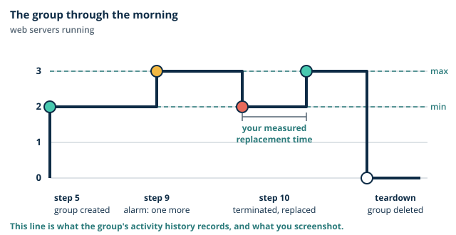

# Lab 7: Build component 12, then the break/fix drill

**Day 7, both sessions. One sheet for two labs: in the morning you build component 12 (Load balancer and Auto Scaling group) round component 6 (Portal web tier) of the Thara Hospitals architecture, and in the afternoon you find and repair five faults that a partner has put into your environment. The afternoon builds no new component.**

| | |
|---|---|
| Learning outcomes | LO2, LO3, LO4, LO5, LO7, LO8 |
| Sub-outcomes | S3.1, S5.5 (morning); S5.4, S7.3, S8.3 (afternoon) |
| Prerequisites | From Day 6: `thara-bastion` and `thara-web-1`, both stopped, `thara-web-role`, the S3 gateway endpoint on `thara-private-rt`, and the flow log `thara-flow-logs`. From Day 5: `thara-trail`, GuardDuty and the Access Analyzer analyzer. From Day 2: the image `thara-portal-v1`. On your computer: `thara-key.pem`. For the afternoon: your group's capstone diagram |
| Estimated credit consumption | USD 1.50 for the morning lab and USD 0.30 for the afternoon drill: USD 1.80 for the day |
| Evidence pack | None for Day 7. The portfolio has six packs, for Days 1 to 6. Today's records are for you and for your capstone |

## 0. Before you start

1. Region check: the console shows **Asia Pacific (Mumbai) ap-south-1**. If not, change it now.
2. You are signed in as your **admin IAM user**, not root.
3. Tags for everything today: `Module=CC`, `Day=7`, `Owner=<student id>`.
4. Open your cost ledger. Write today's date and the segment names below with a blank cost column.

Console labels below are as they appeared at the time of writing. AWS renames buttons from time to time; if a label differs, look for the same idea nearby and tell your lecturer.

You need the same terminal as on Day 6, opened in the folder that holds `thara-key.pem`, the email inbox of the address you will give for alerts, and a clock you can read to the minute.

### The ideas behind the morning lab

Read the [morning notes](notes.md) first. Four things are worth holding in your head while you build.

**Three resources, three jobs.** The [launch template](../../glossary.md#launch-template) says what a web server is. The [Auto Scaling group](../../glossary.md#auto-scaling-group) says how many there must be, and replaces one that fails. The load balancer gives patients one way in and checks which servers may be sent requests. None of them does another's job: you create all three, and the group is told about the load balancer through a [target group](../../glossary.md#target-group).

**These servers have no names.** `thara-web-1` was a server you knew. The group's instances are told apart only by their instance id, which each one writes on its own page at first boot. If one is terminated, nobody repairs it. Another is started from the template.

**The load balancer bills by the hour.** It is created in segment 2 and deleted in the teardown, before the break. Your ledger records both times, and the two must be less than two hours apart.

**A health check is a loaded instruction.** The group believes what the load balancer tells it. If the check is wrong, the group destroys healthy servers because it was told they were sick. The break-it shows you this on purpose.



> **Quick check.** `thara-web-tg` checks the path `/` on each web server. Someone changes the path to one that does not exist, and every target fails its check at once. What does `thara-web-asg` do?
>
> - [x] It starts replacing web servers that are in fact healthy
> - [ ] It does nothing, because the page itself still loads
> - [ ] It removes one instance, because fewer are now needed
>
> **Why:** The group was told to trust the load balancer's health checks, so an instance reported unhealthy is terminated and replaced, however well it is working. The page may still load for a while, which is what makes the mistake easy to miss.

### The ideas behind the afternoon drill

#### The Well-Architected Framework as a review method

The [Well-Architected Framework](../../glossary.md#well-architected-framework) is AWS's own way of reviewing a design. Three things matter this afternoon.

- **Six pillars as questions, not adjectives.** Operational excellence, security, reliability, performance efficiency, cost optimization and sustainability are the six names. "Is it secure?" is an adjective and gets the answer yes. "Who can read patient data, and how would we know if someone did?" is a question, and it has an answer you can check. For each pillar you ask the question, not the adjective.
- **The Well-Architected Tool demonstrated against one volunteer group's design.** The tool is a questionnaire in the console. Your lecturer runs it against one group's capstone diagram, so that you see which questions it asks and how it marks a risk.
- **LO1 callback: is any part of the capstone better as a container, and what would that change?** On Day 1 you argued virtual machines against containers for the portal. Ask it again of the design you have now built: the image, the launch template and the group would each change.

> **Thara.** The Head of IT must defend the pilot to the board; the review is the defence. A board does not read route tables. It asks the six questions in its own words, and a design that has already been reviewed against them has its answers ready.

#### Decommissioning is a skill

Building is half of a pilot. Taking it down without losing what must be kept is the other half.

- **Clean deletion order; what to retain until marking; zero forecast as the proof.** Things are deleted in the reverse of the order in which they depend on each other: instances before their network, the network last. Some things are kept on purpose, such as the snapshots and the trail's bucket, because they are the evidence. The proof that you have finished is a forecast for next month that reads zero or close to it.
- **Free Plan expiry, the six-month clock, and the 90-day grace period.** At the time of writing a Free Plan account ends six months after it was opened, or when its credits are used up, whichever comes first. The account then closes. AWS keeps its content for 90 days, and within that time you can get it back by upgrading to a paid plan. After that it is deleted for good. Know the date on which your own clock runs out, and your host account's.

**How the drill runs.** You and a partner swap seats, not passwords. Each of you introduces the same five faults at the other's console, then you swap back and repair your own environment. You already know what the five faults are. The skill being practised is the one a real incident asks for: to say for each fault what the symptom was, which evidence located it, and what fixed it.

**Not every fault has a symptom, and not every source speaks.** Two of the five stop something working. Three change nothing that you would notice, and are found only by reading. Two of the evidence sources you are asked to consult will tell you nothing at all, and writing that down is part of the record.

> **Common mistake.** "Turning off Block Public Access raises a warning." It does not. The console stays quiet, and Access Analyzer reports a bucket only when a policy or an access control list also grants public access. Removing the guard makes nothing public by itself, so nothing is reported, and the guard is still gone.

> **Common mistake.** "A wildcard policy is harmless if nobody uses it." It is the first thing an attacker uses. A role that may do anything turns one compromised web server into the whole account.

> **Quick check.** During the drill a default route to the internet gateway appears in `thara-private-rt`. Every check you run still works as before. Is it a fault?
>
> - [ ] No: nothing has stopped working, so nothing is wrong
> - [ ] Only if one of the instances in it is stopped
> - [x] Yes: it has no symptom, and the private subnets are now public
>
> **Why:** A subnet is public because its route table sends `0.0.0.0/0` to an internet gateway, as Day 3 defined it. Nothing breaks today because no instance there has a public address. The first one that is given such an address is on the internet.

## 1. Objective

At the end of the morning the portal has been served from two web servers in two availability zones behind one name, a third has appeared under load and gone unnoticed by patients, a terminated server has been replaced without you, and the load balancer has been deleted again: component 12, round component 6. At the end of the afternoon you have repaired five faults in your own environment with a record of how each was found, reviewed your group's capstone design, and taken your own account down to what must be kept. The morning serves Thara's requirement that the portal ride out the OPD peaks and the dengue season inside the CFO's ceiling. The launch template you write is the model for the one your capstone group builds.

## 2. Timed segments

### Morning: build component 12

| Segment | Minutes | Cost note |
|---|---|---|
| Launch template and target group | 20 | nil |
| ALB across both public subnets | 20 | about USD 0.025 per hour plus LCU |
| ASG min 2 across both private subnets | 20 | two to three `t3.micro` |
| Alarm, load, scale-out, replacement, SNS | 25 | nil |

### Afternoon: the break/fix drill

| Segment | Minutes | Cost note |
|---|---|---|
| Introduce faults in a partner's environment | 20 | nil |
| Diagnose and repair your own | 50 | nil |
| Debrief by fault | 20 | nil |

Segments containing a NAT gateway, a load balancer or a database are created, used and deleted inside the segment. Do not carry them across the break. Today the load balancer lives from segment 2 to the morning teardown, and it is gone before you leave the room for the break. Left running, it costs about USD 0.85 a day with its two public addresses. The load balancer's price is charged by the hour and by the LCU, a unit that measures how much traffic it handled; your traffic today is a few page loads. Prices are for ap-south-1 at the time of writing.

## 3. Steps

Each step states what to do and what you should see. If you do not see it, stop and diagnose before moving on.

### Morning: build component 12

*Segment 1: Launch template and target group*

1. **Check where you are, who you are, and how much you may run.** Confirm the region selector shows **Asia Pacific (Mumbai) ap-south-1** and the top bar shows `admin-<student id>`. Open the **Service Quotas** console, choose **AWS services**, **Amazon Elastic Compute Cloud (Amazon EC2)**, and find **Running On-Demand Standard (A, C, D, H, I, M, R, T, Z) instances**. Read its **Applied account-level quota value**, which is counted in vCPUs. Then, in EC2, confirm that `thara-web-1` is **Stopped**, and start `thara-bastion` only. It comes back with a new public address, and your own address may have changed, so open **Security groups**, `thara-bastion-sg`, **Edit inbound rules**, set the source of the SSH rule to **My IP** again, and save. Note the bastion's new **Public IPv4 address**. *Expected:* a quota of 8 or more, `thara-web-1` stopped, and `thara-bastion` running. A `t3.micro` has 2 vCPUs, and at its busiest this lab runs the bastion and three web servers: 8 vCPUs. If your value is lower, tell your lecturer now and carry on: step 9 says what you will see. `thara-web-1` stays stopped all morning, because the group's servers take its place.

2. **Write down what a web server is.** In EC2 choose **Launch Templates**, **Create launch template**. Set the page as follows, and leave anything not listed as it is offered.

   | Setting | Choose |
   |---|---|
   | Launch template name | `thara-web-lt` |
   | Auto Scaling guidance | tick the box |
   | Application and OS Images | **My AMIs**, **Owned by me**, `thara-portal-v1` |
   | Instance type | `t3.micro` |
   | Key pair | `thara-key` |
   | Subnet | **Don't include in launch template** |
   | Security groups | **Select existing security group**, `thara-web-sg` |
   | Resource tags | the three tags, with `Day=7`, on **Instances** and **Volumes** |
   | Advanced details: IAM instance profile | `thara-web-role` |
   | Advanced details: Detailed CloudWatch monitoring | **Enable** |

   At the foot of **Advanced details**, paste this into **User data**:

   ```bash
   #!/bin/bash
   TOKEN=$(curl -s -X PUT "http://169.254.169.254/latest/api/token" \
     -H "X-aws-ec2-metadata-token-ttl-seconds: 60")
   ID=$(curl -s -H "X-aws-ec2-metadata-token: $TOKEN" \
     http://169.254.169.254/latest/meta-data/instance-id)
   echo "<p>Served by $ID</p>" >> /var/www/html/index.html
   ```

   Choose **Create launch template**. *Expected:* `thara-web-lt` is listed, at version 1. Read what you chose. The image is the Day 2 web server, with the pilot page already in it. The script runs once on each new server, asks the instance for its own id, as the Day 2 demonstration did, and adds one line to the page, so that you can tell two servers apart from a browser. No subnet is named, because the group decides where each server goes. Detailed monitoring makes each server report its CPU every minute, not every five; without it the alarm in step 8 would have nothing to read for four minutes in every five. It costs a few cents for the morning.

3. **Make the list the load balancer will send to.** In EC2 choose **Target Groups**, **Create target group**. Target type **Instances**. Target group name `thara-web-tg`. Protocol **HTTP**, port `80`. VPC `thara-vpc`. Under **Health checks**, protocol **HTTP** and health check path `/`. Add the three tags, choose **Next**, register nothing, and choose **Create target group**. *Expected:* `thara-web-tg` is listed with no registered targets. You do not add servers to it by hand: the group will. Open its **Health checks** tab and read the settings you accepted: a request every 30 seconds, unhealthy after 2 failures, healthy after 5 successes. You will meet those numbers again as waiting time.

*Segment 2: ALB across both public subnets*

4. **Create the load balancer, and write the time.** First its firewall: **Security groups**, **Create security group**, name `thara-alb-sg`, description `HTTP to the portal from anywhere`, VPC `thara-vpc`, one inbound rule of type **HTTP** with the source **Anywhere-IPv4**, and the three tags. Then **Load Balancers**, **Create load balancer**, **Application Load Balancer**:

   | Setting | Choose |
   |---|---|
   | Load balancer name | `thara-alb` |
   | Scheme | **Internet-facing** |
   | VPC | `thara-vpc` |
   | Availability Zones and subnets | both zones, with `thara-public-a` and `thara-public-b` |
   | Security groups | `thara-alb-sg` only. Remove `default` |
   | Listener | **HTTP**, port `80`, forward to `thara-web-tg` |

   Add the three tags and choose **Create load balancer**. **Write the time in your ledger.** Now make the web tier listen to the load balancer and to nothing else: open `thara-web-sg`, **Edit inbound rules**, and change the source of the **HTTP** rule from **Anywhere-IPv4** to **Custom**, `thara-alb-sg`. Leave the SSH rule from `thara-bastion-sg` as it is. Save. *Expected:* `thara-alb` moves from **Provisioning** to **Active** in two or three minutes, and its details show a **DNS name** that ends `.elb.amazonaws.com`. Copy it. The load balancer stands in the public subnets and the web servers in the private ones. Since Day 3 the web tier's HTTP rule had said "anywhere", which no route could use. Now it says what you mean: web requests come from the load balancer.

*Segment 3: ASG min 2 across both private subnets*

5. **Say how many there must be.** In EC2 choose **Auto Scaling Groups**, **Create Auto Scaling group**. The wizard has seven pages.

   | Page | Choose |
   |---|---|
   | Choose launch template | name `thara-web-asg`; launch template `thara-web-lt` |
   | Choose instance launch options | VPC `thara-vpc`; subnets `thara-private-a` and `thara-private-b` |
   | Integrate with other services | **Attach to an existing load balancer**, **Choose from your load balancer target groups**, `thara-web-tg`; tick **Turn on Elastic Load Balancing health checks**; leave the health check grace period at 300 seconds |
   | Configure group size and scaling | **Desired capacity** `2`, **Min desired capacity** `2`, **Max desired capacity** `3`; **No scaling policies**; tick **Enable group metrics collection within CloudWatch** |
   | Add notifications | nothing |
   | Add tags | the three tags, with `Day=7` |
   | Review | **Create Auto Scaling group** |

   *Expected:* within a minute the group's **Activity** tab lists two launches, and its **Instance management** tab shows two instances, one in each zone, moving to **InService**. In **Target Groups**, `thara-web-tg`, the **Targets** tab shows both, first as **Initial** and after about two and a half minutes as **Healthy**. You asked for two and named two subnets, and the group spread them across the zones without being told. The numbers mean: never fewer than two, two unless something says otherwise, and never more than three.

6. **Load the portal by its one name.** Paste the load balancer's DNS name into a browser, as `http://<DNS name>`. Reload a dozen times. *Expected:* the page reads **Thara Hospitals portal (pilot)** and, beneath it, **Served by** and an instance id. As you reload, the id changes between two values. Write both down. Take a screenshot of each. One name, two servers, two zones: this is the first proof. If the page waits and fails, check that both targets are **Healthy** and that `thara-web-sg` names `thara-alb-sg` as its HTTP source.

*Segment 4: Alarm, load, scale-out, replacement, SNS*

7. **Give the alarm somewhere to send.** Open the Simple Notification Service console, check the region, and choose **Topics**, **Create topic**. Type **Standard**, name `thara-alerts`, the three tags, **Create topic**. Then **Create subscription**: protocol **Email**, endpoint your own email address. Open your inbox and choose **Confirm subscription** in the message from AWS. *Expected:* the subscription's status changes from **Pending confirmation** to **Confirmed**. A topic is a named place to which a service publishes a message; whoever has subscribed receives it. Nothing is sent to an address that has not confirmed.

8. **Tell the group when to grow.** First the [alarm](../../glossary.md#alarm). Open CloudWatch, **Alarms**, **All alarms**, **Create alarm**, **Select metric**. Choose **EC2**, **By Auto Scaling Group**, and tick **CPUUtilization** for `thara-web-asg`. Statistic **Average**, period **1 minute**. Condition **Static**, **Greater**, than `50`. Under **Additional configuration**, datapoints to alarm `2` out of `2`. Choose **Next**. Under **Notification**, alarm state trigger **In alarm**, **Select an existing SNS topic**, `thara-alerts`. Choose **Next**, name the alarm `thara-web-asg`, and create it. Then the policy: in **Auto Scaling Groups**, `thara-web-asg`, open the **Automatic scaling** tab and choose **Create dynamic scaling policy**. Policy type **Simple scaling**, scaling policy name `thara-web-asg`, CloudWatch alarm `thara-web-asg`, take the action **Add** `1` **capacity units**, and then wait `300` seconds before allowing another scaling activity. Create it. *Expected:* the alarm is listed with the state **OK**, or **Insufficient data** for its first minutes, and the group shows one dynamic scaling policy. Read it as a sentence: when the average CPU of the group stays above 50% for two minutes, add one server and send an email, then wait five minutes. The wait is the [cooldown](../../glossary.md#cooldown). The policy and the alarm take the group's name because they belong to it.

9. **Make the servers busy.** In EC2, **Instances**, note the **Private IPv4 address** of each of the group's two instances: one begins `10.0.11.` and the other `10.0.12.`. Connect to the bastion as on Day 6, and from the bastion connect to each web server in turn:

   ```bash
   ssh-add thara-key.pem
   ssh -A ec2-user@<bastion public IPv4 address>
   ssh ec2-user@<first web private address>     # typed on the bastion
   ```

   On each web server run these three lines, then go to the other one and do the same:

   ```bash
   for i in 1 2; do nohup timeout 600 yes > /dev/null 2>&1 & done
   top -bn1 | head -3
   exit
   ```

   Write the time. Then watch three places: the alarm in CloudWatch, the group's **Activity** tab, and your inbox. *Expected:* `top` shows the CPU almost fully in use. Within about three minutes the alarm changes to **In alarm**, an email from AWS Notifications arrives, and the **Activity** tab lists a new launch whose cause names the alarm. The group's desired capacity now reads 3. A few minutes later a third target is **Healthy**, and a third instance id joins the two on the portal's page. The load ends by itself after ten minutes. You loaded both servers because the alarm reads the average: one server at full load and one idle is about 50%, which is not above 50%. If the launch fails and the activity's status names a vCPU limit, your quota from step 1 is the cause: take a screenshot of that activity, write one line saying why it failed, and carry on. The group stays at three after the load ends, because you gave it a rule for growing and none for shrinking.

10. **Destroy a server, and time its replacement.** In EC2, **Instances**, select one of the group's instances, **Instance state**, **Terminate (delete) instance**. **Write the time, to the minute.** Watch `thara-web-tg`, **Targets**, and the group's **Activity** tab, and keep reloading the portal. *Expected:* the target's status changes to **Draining**, and the group launches a replacement without being asked, with a cause that says an instance was taken out of service. The portal keeps answering from the servers that remain. When the new target shows **Healthy**, write the time. The minutes between the two times are your **measured replacement time**. Nobody repaired the server you destroyed. The group noticed that it had fewer than it was told to keep, and started another from the template.

11. **Read the bill.** Open Billing and Cost Management, **Cost Explorer**. Set the date range from the first day of the module to today, and **Group by** the dimension **Service**. Then change **Group by** to **Tag** and look for `Owner`. *Expected:* by service, a bar for each service you have used, with EC2 and its related lines the largest. By tag, one of two things. If `Owner` is offered, the costs are grouped under your student id, with a separate group for whatever carries no tag. If `Owner` is not offered, the tag has not been activated for billing: open **Cost allocation tags**, select `Owner`, `Module` and `Day` under **User-defined cost allocation tags**, choose **Activate**, and use the view by service today. A tag groups costs only from the time it is activated, and activation takes up to a day. Write the module-to-date figure beside your ledger's total, and take a screenshot that shows the figure. This morning's load balancer is not in it yet: Cost Explorer is up to a day behind. The notes explain the two reasons why the figures differ.

12. **Finish the morning before the break.** Do section 4, section 5 and section 6, each under its **Morning** heading, in that order, and write the ledger rows in section 7. The load balancer must be gone before you leave the room.

### Afternoon: the break/fix drill

*Segment 1: Introduce faults in a partner's environment*

13. **Bring the environment back, and prove it works.** Start `thara-bastion` and the Day 3 `thara-web-1`, which is still in `thara-private-a`: **Instance state**, **Start instance**. Do not launch another server from the template: two servers named `thara-web-1` is a fault you removed on Day 3. Set the SSH source of `thara-bastion-sg` to **My IP** again, note the bastion's new public address, connect, hop to `thara-web-1`, and run:

    ```bash
    aws s3 ls s3://thara-reports-<student id>
    aws s3 ls
    exit
    ```

    *Expected:* a prompt on `thara-web-1`, the first command lists `reports-index.txt`, and the second is refused with **AccessDenied**, because `thara-web-role` may list one bucket and no more. Leave the terminal on the bastion. This is your baseline: write down that all three results were as expected, with the time. A fault can only be recognised against something you know was working.

14. **Swap seats, and break your partner's environment.** Pair up. Swap seats, never passwords: you work at your partner's console, in their signed-in session, and they work at yours. Take the fault sheet from your lecturer and introduce these five faults, in this order, ticking each one:

    | Fault | Where | What to do |
    |---|---|---|
    | 1 | VPC, **Route tables**, `thara-public-rt` | **Edit routes**, remove the route for `0.0.0.0/0`, save |
    | 2 | EC2, **Security groups**, `thara-web-sg` | **Edit inbound rules**, delete every rule, save |
    | 3 | VPC, **Route tables**, `thara-private-rt` | **Edit routes**, add `0.0.0.0/0` with the target **Internet Gateway**, save |
    | 4 | S3, `thara-reports-<student id>`, **Permissions** | **Block public access**, **Edit**, clear **Block all public access**, save, and confirm |
    | 5 | IAM, **Roles**, `thara-web-role` | **Add permissions**, **Create inline policy**, **JSON**: keep the `Version` line and make the statement allow the action `*` on the resource `*`. Give the policy any name you like |

    For fault 5 the `Statement` list reads:

    ```json
    "Statement": [
      { "Effect": "Allow", "Action": "*", "Resource": "*" }
    ]
    ```

    *Expected:* five ticks on the fault sheet, and nothing else changed. Do exactly these five and no others: the list is controlled so that every fault is safe and can be put right. Fault 4 removes a guard and makes nothing public, because the bucket's policy still names one role. Do not add a public statement to the policy. Close nothing, sign out of nothing, and go back to your own seat.

*Segment 2: Diagnose and repair your own*

15. **Find all five, repair them, and keep the record.** You are at your own console again, and five things are wrong. For each fault write one row in the table below: the symptom, the evidence that located it, the fix, and the time on the clock when it was fixed.

    | Fault | Symptom (or "none") | Evidence that located it | Fix | Fixed at |
    |---|---|---|---|---|
    | | | | | |

    Work from what fails to what does not. First repeat the three checks of step 13, and note which fail and how: a wait that times out is a different symptom from a refusal. Then read, in whatever order the symptoms suggest:

    - **The route tables.** In VPC, **Route tables**, open `thara-public-rt` and `thara-private-rt` and read the **Routes** tab of each against what you built on Days 3 and 4.
    - **The flow log.** In CloudWatch, **Log groups**, `thara-flow-logs`, **Search all log streams**, search for `REJECT` in the last hour. A record shows a packet that arrived and was refused. No record means that the packet never arrived.
    - **CloudTrail event history.** In CloudTrail, **Event history**, set the time range to the last hour and filter **Read-only** to `false`, so that only changes are listed. Open an event and read who made it, when, and to which resource.
    - **Access Analyzer.** In IAM, **Access analyzer**, read the findings of the analyzer you created on Day 5.
    - **The console itself.** The **Permissions** tab of the reports bucket, the inbound rules of `thara-web-sg`, and the **Permissions** tab of `thara-web-role`.

    Repair each fault as you find it, and run the three checks again at the end. *Expected:* all five rows are filled in, the three checks give the results of step 13 again, **Block all public access** is **On**, `thara-web-sg` has its two rules (HTTP from `thara-alb-sg`, SSH from `thara-bastion-sg`), and `thara-web-role` has one policy, `thara-reports-read`. Two sources will have told you nothing. Access Analyzer has no finding for any of the five, and the change to the role is not in this region's event history, because IAM is a global service and its events are recorded elsewhere; your trail still delivers them to `thara-audit-<student id>`. Write both silences in the evidence column. Look also at the name on every event you did find: it is your own.

*Segment 3: Debrief by fault*

16. **Debrief, fault by fault.** With your partner, and then with the room, answer two questions for each fault. Which evidence source found it fastest? And which of the five would the Data Protection Officer care about most? Write your pair's answer to the second in one sentence under your table. *Expected:* your table has a fastest source for every row, and the room does not agree on the second question at first. The Head of IT and the Data Protection Officer rank these five differently, and both are right about their own concern.

17. **Take your account down.** After the capstone workshop, do section 6 under its **Afternoon** heading, then write the last ledger row in section 7.

## 4. Prove it

### Morning

Do these at step 12. Keep each with your own records.

- The load balancer's DNS name serves the pilot page from two instance ids: your two screenshots from step 6.
- In **Auto Scaling Groups**, `thara-web-asg`, the **Activity** tab, the activity history shows a launch caused by the alarm (the scale-out, step 9) and a launch that replaced a terminated instance (step 10). Take one screenshot that shows both.
- The email from `thara-alerts` arrived: a screenshot of the message, with your address masked.

### Afternoon

- All five faults repaired, with the symptom and the evidence source written for each: your table from step 15, and the three checks of step 13 passing again.

## 5. Break it

### Morning

Do this at step 12, while the group still exists.

**Fault:** someone "tidies" the health check and points it at a page that is not there.

1. In EC2 open **Target Groups**, `thara-web-tg`, the **Health checks** tab, **Edit**. Change the health check path from `/` to `/missing`, and save. Write the time.
2. Predict, in writing, what the patients will see and what the group will do. Then watch the **Targets** tab, the group's **Activity** tab, and the portal in your browser. **Symptom:** within about a minute every target reads **Unhealthy**. The portal still loads. Then the group begins to terminate servers and launch new ones, which fail the same check.
3. **Locate it** with what the console tells you. On the **Targets** tab, the **Health status details** of each target say that the health check failed with the code 404: the server answered, and the page it was asked for does not exist. In the **Activity** tab, each termination's cause says that the instance was taken out of service because the load balancer reported it unhealthy. The servers were never ill. The page still loaded because a target group whose targets are all unhealthy sends requests to all of them, which hides the fault from anyone who only looks at the portal.
4. **Fix:** revert at once. Set the health check path to `/` again and save. Watch the targets return to **Healthy**, which takes five successful checks, about two and a half minutes. Do not leave the fault in place for longer than it takes to see the first replacement.

Record the fault, the symptom, the evidence that located it and the fix. Then say, in two sentences, why this is the most dangerous misconfiguration in the module: one wrong word, in a setting that is not a firewall and not a permission, made the system destroy its own healthy servers, while the page went on loading.

### Afternoon

This session is the break it. The five faults of step 14 are the faults, and your table from step 15 is the record.

## 6. Teardown

### Morning

Do these in order, before the break. Check your ledger rows are written first.

1. **Delete the group.** In **Auto Scaling Groups** select `thara-web-asg`, **Actions**, **Delete**, and confirm. *Expected:* the group's instances are terminated with it, and its scaling policy goes too. Wait until **Instances** shows them **Terminated**. If you terminate the instances first and leave the group, it launches them again: that is its job.
2. **Delete the load balancer, and write the time.** In **Load Balancers** select `thara-alb`, **Actions**, **Delete load balancer**, and confirm. *Expected:* `thara-alb` is no longer listed. Write the time in your ledger beside its creation time.
3. **Delete the target group.** In **Target Groups** select `thara-web-tg`, **Actions**, **Delete**. *Expected:* it is gone. It can be deleted only once no load balancer uses it.
4. **Delete the alarm.** In CloudWatch, **Alarms**, select `thara-web-asg`, **Actions**, **Delete**. *Expected:* no alarm is listed.
5. **If you ever copied `thara-key.pem` to the bastion**, check that it is gone: on the bastion, `ls ~` should not list it.
6. **Stop `thara-bastion`.** Choose **Instance state**, **Stop instance**. *Expected:* `thara-bastion` and `thara-web-1` both show **Stopped**, and nothing else is running.
7. **Confirm in your ledger that the load balancer existed for under two hours.**

What you keep from the morning, and why:

| Kept | Why |
|---|---|
| `thara-web-lt` | It costs nothing, and it is the model for your capstone group's own |
| `thara-alerts` and its subscription | It costs nothing. The afternoon's list removes it |
| `thara-alb-sg`, and the HTTP rule of `thara-web-sg` that names it | They cost nothing, and the afternoon's fault 2 is repaired against them |
| `thara-web-role` | `thara-web-1` uses it this afternoon |

### Afternoon

This is the decommissioning of your own account, in the order in which things depend on each other.

**If your account is the host of your group's capstone, do not delete.** Read the list, tick each line on paper for the things the capstone does not use, and stop there. You decommission after the viva, with this list.

Everyone else, in order:

1. **Terminate the two instances.** Select `thara-web-1` and `thara-bastion`, **Instance state**, **Terminate (delete) instance**. *Expected:* both show **Terminated**, and their root volumes go with them.
2. **Delete the launch template and the topic.** In **Launch Templates** choose `thara-web-lt`, **Actions**, **Delete template**. In the Simple Notification Service console delete the subscription, then the topic `thara-alerts`.
3. **Switch off the watcher that will start to bill.** In GuardDuty, **Settings**, choose **Disable GuardDuty**. Its trial ends 30 days after Day 5, and after that it bills for what it analyses.
4. **Delete the Backup plan and what it made.** In AWS Backup, **Backup plans**, `thara-daily`: delete the resource assignment `thara-daily`, then the plan. In **Vaults**, **Default**, delete any recovery point that is listed.
5. **Delete the flow log and its records.** In VPC, `thara-vpc`, the **Flow logs** tab: delete the flow log. In CloudWatch, **Log groups**, delete `thara-flow-logs`.
6. **Delete the S3 gateway endpoint.** VPC, **Endpoints**, select it, **Actions**, **Delete VPC endpoints**.
7. **Delete the DB subnet group.** RDS, **Subnet groups**, `thara-db-subnets`, **Delete**.
8. **Delete the network.** VPC, **Your VPCs**, select `thara-vpc`, **Actions**, **Delete VPC**. The console lists what goes with it: the four subnets, the route tables, the internet gateway, the network ACLs and the security groups, among them `thara-alb-sg`, `thara-web-sg`, `thara-db-sg` and `thara-bastion-sg`. Confirm. *Expected:* `thara-vpc` is gone, and only the default VPC is listed. If the console refuses, it names what is still attached; a network interface usually means that an instance has not finished terminating.
9. **Confirm the forecast.** In Cost Explorer read the forecast for next month. *Expected:* zero, or a few cents for what you kept. Write it as the final row of your ledger.

What you keep until marking is complete, and why:

| Kept | Why |
|---|---|
| The image `thara-portal-v1` and its snapshot | The proof of Day 2, and what a rebuild would start from |
| The snapshot of the Day 2 data volume, and `thara-records-snap1` | The proof of Days 2 and 6. A few cents a month |
| `alias/thara-records` | `thara-records-snap1` is encrypted with it and cannot be restored without it. About USD 0.03 a day |
| `thara-reports-<student id>` | The reports bucket's versions, lifecycle rule and policy are evidence of Day 6 |
| `thara-audit-<student id>` and `thara-trail` | The record of everything you did, including this afternoon |
| Your users, `thara-web-role`, `thara-budget` and the Access Analyzer analyzer | They cost nothing, and the budget is still your alarm |

Your Free Plan account runs for six months from the day you opened it, or until its credits are used. Write that date in your ledger now.

## 7. Cost line

Estimate for the morning: **USD 1.50**. The morning itself comes to about USD 0.25: about an hour and a half of the load balancer with its two public IPv4 addresses, up to three `t3.micro` web servers and the bastion for two hours, detailed monitoring, and a few cents for ten minutes of full CPU on servers that are priced for bursts. The rest is room for a load balancer that was left running, which would use it up in a day.

Estimate for the afternoon: **USD 0.30**. Two `t3.micro` instances for three hours with the bastion's public address come to about USD 0.10, and what you keep afterwards costs about USD 0.03 a day for the key and a few cents a month for the snapshots.

Add one ledger row for each of: `thara-bastion` (two starts and two stops); `thara-web-lt`, `thara-web-tg`, `thara-alb-sg` and `thara-alerts` (cost 0.00); `thara-alb` (created and deleted, with the minutes between); `thara-web-asg` (created and deleted, with the largest number of instances it ran and the **measured replacement time**); the alarm (created and deleted); `thara-web-1` (started, terminated); and one row for the decommissioning, with the forecast for next month. Write the day's total against the estimate. If it is higher than the estimate, write why in one line.

## 8. Evidence required

There is no evidence pack for Day 7. Keep these with your own records: the first three belong in your capstone's design justification, and the ledger completes your individual ledger.

### Morning

1. The activity history of `thara-web-asg` showing the scale-out and the replacement (section 4).
2. Ledger rows with the creation and deletion times of `thara-alb`.
3. The Cost Explorer screenshot, by `Owner` tag or by service, with your ledger's total beside it (step 11).
4. Your break-it record from section 5, with your two sentences.

### Afternoon

5. Your fault diagnosis record: the table from step 15 and your sentence from step 16. It is formative: it is not marked, and it is not part of the portfolio.
6. The decommissioning confirmation as the final row of your ledger: the forecast, and the list of what you kept.

Check every screenshot before you share it: no password, your email address masked, and the middle digits of your account id masked.

## 9. Thara connection

This day meets the requirement that the portal ride out the morning OPD peaks, from 07:00 to 10:00, and the dengue-season surges, and it answers the flood. One server in one basement was a single point of failure. This morning the portal ran on two servers in two availability zones behind one name, grew to three when it was busy, and replaced a server that you destroyed, in a number of minutes you measured. The CFO would ask what the third server costs: by the hour, and only in the hours when it runs, which is why her ceiling does not have to buy a server sized for the peak. She would also ask you to read the bill back to her, and you have now compared your ledger with Cost Explorer. The Head of IT must defend the pilot to the board, and the six questions of this afternoon's review are that defence. The Data Protection Officer would ask the question he has asked since Day 3: how would we know? This afternoon you found five changes after the event, and for four of them the trail named a person and a time. It named you, because your partner worked in your session. That is why the requirement says every administrative action must be attributable to a named person, and why nobody shares a sign-in. One thing remains for your capstone group: the lab's listener is plain HTTP, and Thara requires TLS at the edge.

Practice: if any of practice questions 1 to 6 is still not attempted, do it before the review session. They are in [practice](../../practice/README.md).
